# Cash Flow Planner Desktop — System Design Document

**Version:** 1.5  
**Date:** July 11, 2026  
**Status:** Draft  

---

## Table of Contents

1. [Executive Summary](#1-executive-summary)
2. [Product Requirements](#2-product-requirements)
3. [System Architecture](#3-system-architecture)
4. [Tech Stack](#4-tech-stack)
5. [Domain Model](#5-domain-model)
6. [Date Pattern System](#6-date-pattern-system)
7. [Data Layer](#7-data-layer)
8. [Business Logic Layer](#8-business-logic-layer)
9. [Application Layer](#9-application-layer)
10. [Presentation Layer](#10-presentation-layer)
11. [Data Flow](#11-data-flow)
12. [UML Diagrams](#12-uml-diagrams)
13. [Currency System](#13-currency-system)
14. [Error Handling](#14-error-handling)
15. [Testing Strategy](#15-testing-strategy)
16. [Build and Release Pipeline](#16-build-and-release-pipeline)
17. [Non-Functional Requirements](#17-non-functional-requirements)

---

## 1. Executive Summary

**Cash Flow Planner Desktop** is an offline-first **cash-flow forecasting** and **scenario-planning** tool for individuals and small businesses. Users define recurring and one-time income and expense entries using a flexible date-pattern syntax. The system projects those entries over a user-specified time horizon, computes a running balance, and surfaces the exact date and amount at which cash flow first goes negative — so users can act before real-world shortfalls occur. What-if simulations let users temporarily override entries and compare outcomes without changing the saved forecast.

The application is self-contained, stores all data locally on the user's machine (no cloud dependency), and is distributed as a native desktop binary for macOS, Windows, and Linux.

---

## 2. Product Requirements

### 2.1 Functional Requirements

| ID | Requirement |
|----|-------------|
| FR-01 | Users can create, edit, and delete **income entries** with fields: name, date pattern, amount, currency. |
| FR-02 | Users can create, edit, and delete **expense entries** with fields: name, date pattern, category, amount, currency. |
| FR-03 | The date pattern syntax supports four recurrence modes: daily (`...`), monthly (`DD..`), yearly (`DD.MM.`), and one-time (`DD.MM.YYYY`). |
| FR-04 | Users can configure a **simulation period** (start date + duration in months or an explicit end date). |
| FR-05 | The system expands all entries into a chronologically ordered list of **financial events** for the simulation period. |
| FR-06 | The system computes a **running balance** across all events, starting from an optional initial balance. |
| FR-07 | The system identifies the **first negative balance point** (if any) and reports which event caused it. |
| FR-08 | Users can define **currency exchange rates** for multi-currency normalization to a base currency. |
| FR-09 | The system presents a **monthly summary** view (income total, expense total, net, running balance per month). |
| FR-10 | Users can export simulation results as CSV or PDF. |
| FR-11 | Users can manage multiple independent **financial plans** (scenarios). |
| FR-12 | Entries can be grouped by **category** (e.g., basic, groceries, finances). |
| FR-13 | Users can **import entries from CSV or Excel** files. The date pattern is encoded as a plain string in the import file using the same syntax: `...` (daily), `10..` (monthly on the 10th), `10.02.` (yearly on Feb 10), `10.02.2026` (one-time). |
| FR-14 | Users can run a **what-if simulation** with temporary overrides on one or more entries (amount, pattern, active state) without persisting those changes to the plan. The simulation executes against the overridden values; the saved plan remains unchanged. |
| FR-15 | The app optionally fetches **live exchange rates** from a public API (Open Exchange Rates / exchangerate.host) via `httpx`, caching the result locally. Manual rates remain the fallback when the network is unavailable or the feature is disabled. |
| FR-16 | The UI supports **multiple languages** (English, French, Russian, Spanish, German). The user selects a language in Settings; the interface retranslates immediately without restarting the app. The selected language is persisted in `QSettings`. |
| FR-17 | Users can **export a complete financial plan** to a portable `.ftplan` file and **import** it to create a new plan on the same or another device. The bundle includes plan metadata, all entries (including `is_active`), and referenced `foreign → plan.base_currency` exchange rates. On import, missing rates are added automatically; conflicting global rates require explicit user resolution in the import preview (keep local vs use file). |
| FR-18 | Product copy and documentation position the app as a cash-flow forecasting and scenario-planning tool, not a budget tracker. |
| FR-19 | Users can export an **executive PDF report** containing a monthly cash bridge, optional scenario comparison, and plan-scoped FX footnotes. |
| FR-20 | Users can create a new forecast from a bundled template (SaaS startup, consulting firm, retail shop) with pre-filled cash flows and categories. |
| FR-21 | The app provides a methodology page explaining cash shortfall detection and normalization; an audit trail of forecast and cash-flow changes; and provenance metadata in all export formats. |
| FR-22 | Executive PDF export includes semantic color-coded tables, a balance projection chart, and a translated methodology appendix; redundant metadata footer removed. |
| FR-23 | The app ships a **user manual PDF** — a narrative onboarding guide with branded cover, table of contents, callouts, and PDF bookmarks. Content is translatable; English is bundled at ship time; Settings opens the manual for the active locale (fallback to English). |
| FR-24 | After a baseline projection completes, users receive **actionable cash-flow suggestions** — ways to avoid a cash shortfall, reduce spending, increase income, or save more — from deterministic analysis of their forecast. Suggestions can pre-fill scenario overrides for preview. |
| FR-25 | Users can record **actual spending** as discrete transactions in an app-wide **spending journal** (name, amount, currency, optional date, category, place). Dictionary tables back autocomplete; the ledger is not tied to a single forecast plan. |
| FR-26 | Users can **analyze recorded spending** on the Spending tab: date-filtered roll-up charts (top categories, places, and names) plus a searchable, filterable transaction list. Search narrows the list only; charts reflect the selected date range. |

**FR-23 acceptance:**

- Eight chapters cover welcome through quick reference using professional terminology (`Forecast`, `Cash flow`, `Cash shortfall`, `Scenario`).
- Structured content lives in `src/app/i18n/manual_content.py` and is extractable via `pyside6-lupdate` (`UserManual` context).
- `ManualPdfExporter` (`src/export/manual_pdf_exporter.py`) renders the manual separately from executive simulation reports.
- `scripts/generate_manual.py` produces PDFs without launching the full UI; reference copies live under `docs/manual/`.
- Settings **Open user manual** materializes the bundled `qrc:/manual/` PDF and opens it in the system viewer.

**FR-24 acceptance:**

- `SuggestionEngine` in `src/domain/` analyzes `SimulationResult` plus active plan entries and returns ranked `Suggestion` value objects (deficit-avoidance and surplus/savings heuristics).
- `SuggestionsViewModel` refreshes on baseline simulation completion only (not what-if-only runs); analysis runs on a `QRunnable` worker.
- `SuggestionsPanel.qml` on the Projection tab shows up to three cards with **Show more**; **Try in scenario** pre-fills `WhatIfPanel` when a structured change hint exists.
- Suggestion copy uses the `CashFlowSuggestions` translation context (`src/app/i18n/suggestion_copy.py`); language changes retranslate via `SuggestionsViewModel.retranslate()`.

**FR-25 acceptance:**

- App-wide ledger: `recorded_expenses` and dictionary tables (`expense_names`, `expense_categories`, `expense_places`) are not scoped to a `plan_id`.
- `RecordedExpenseService` validates input and get-or-creates dictionary rows; repositories use bound parameters only.
- `RecordedExpensesViewModel` exposes CRUD, debounced label search, and list/suggestion models to QML.
- Top-level **Spending** tab (`RecordedExpensesPage.qml`) lists recent transactions; `RecordedExpenseFormDrawer.qml` supports add/edit with autocomplete.
- UI copy uses **Spending** / **recorded expense** (not "budget"); see `docs/TERMINOLOGY.md`.
- Analytics charts and filtered list are covered by **FR-26** (Story 32).

**FR-26 acceptance:**

- `ExpenseAnalyticsEngine` in `src/domain/expense_analytics.py` aggregates expenses by name, category, and place with multi-currency normalization via stored exchange rates; missing rates raise `CurrencyConversionError`.
- `ExpenseAnalyticsViewModel` exposes date range, display currency (persisted in `QSettings`), chart series (`categorySeries`, `placeSeries`, `nameSeries`), and `totalAmount`; refreshes when recorded expenses are created, updated, or deleted.
- `ExpenseFilterBar.qml` provides date presets (this month, last 30 days, YTD, custom) and debounced text search; changing the date range syncs both the analytics ViewModel and the filtered expense list.
- Text search is a case-insensitive substring match on joined dictionary labels and the expense note; it filters the **transaction list only**, not the charts.
- Charts show the top eight buckets per dimension; remaining buckets are grouped as **Other** (`group_top_n` helper).
- `RecordedExpensesPage.qml` combines `ExpenseFilterBar`, `ExpenseAnalyticsPanel` (three `ExpenseBucketBarChart` instances), and the expense list in a single scrollable view.
- Unit tests cover `ExpenseAnalyticsEngine` aggregation math and `group_top_n`; integration tests cover `ExpenseAnalyticsViewModel` rollups and repository filter queries.
- All new Spending analytics QML strings are extracted via `pyside6-lupdate` and translated in `i18n/app_*.ts`.

### 2.2 Non-Functional Requirements

| ID | Requirement |
|----|-------------|
| NFR-01 | Fully offline — no network required for core functionality. |
| NFR-02 | All data stored locally in a single SQLite database file. |
| NFR-03 | Simulation for up to 10 years of daily entries must complete in under 2 seconds. |
| NFR-04 | Application starts in under 3 seconds on a modern machine. |
| NFR-05 | Distributed as a signed, notarized native binary (macOS .dmg, Windows .exe, Linux .AppImage). |
| NFR-06 | UI must be keyboard-accessible and WCAG 2.1 AA compliant. |

---

## 3. System Architecture

### 3.1 High-Level Architecture

The application runs as a single **Python process** hosting the Qt event loop. Unlike Electron's multi-process model, there is no IPC bridge or renderer sandbox — the UI (QML) and all business logic live in the same process, communicating through Qt's **signal/slot** mechanism and **Q_PROPERTY** bindings. This makes the architecture significantly simpler and eliminates an entire class of serialization and async-boundary bugs.

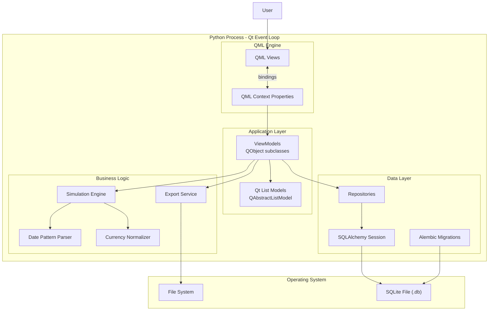
```mermaid
flowchart TB
    subgraph OS_Layer [Operating System]
        FS[File System]
        SQLiteFile["SQLite File (.db)"]
    end

    subgraph Python_Process [Python Process - Qt Event Loop]
        subgraph UI_Layer [QML Engine]
            QML[QML Views]
            QMLCtx[QML Context Properties]
        end

        subgraph App_Layer [Application Layer]
            VM[ViewModels\nQObject subclasses]
            Models[Qt List Models\nQAbstractListModel]
        end

        subgraph Logic_Layer [Business Logic]
            SimEngine[Simulation Engine]
            DateParser[Date Pattern Parser]
            CurrencyNorm[Currency Normalizer]
            ExportSvc[Export Service]
        end

        subgraph Data_Layer [Data Layer]
            Repos[Repositories]
            DB[SQLAlchemy Session]
            Mig[Alembic Migrations]
        end

        QML <-->|bindings| QMLCtx
        QMLCtx --> VM
        VM --> Models
        VM --> SimEngine
        VM --> ExportSvc
        SimEngine --> DateParser
        SimEngine --> CurrencyNorm
        VM --> Repos
        Repos --> DB
        DB --> SQLiteFile
        Mig --> SQLiteFile
        ExportSvc --> FS
    end

    User --> QML
```

### 3.2 Layered Architecture

The codebase is divided into four vertical layers with strict dependency direction (higher layers depend on lower layers, never vice versa).

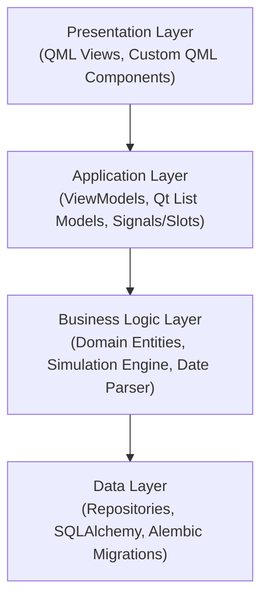
```mermaid
flowchart TB
    P["Presentation Layer\n(QML Views, Custom QML Components)"]
    A["Application Layer\n(ViewModels, Qt List Models, Signals/Slots)"]
    B["Business Logic Layer\n(Domain Entities, Simulation Engine, Date Parser)"]
    D["Data Layer\n(Repositories, SQLAlchemy, Alembic Migrations)"]

    P --> A
    A --> B
    B --> D
```

### 3.3 Qt Signal/Slot Communication

Instead of an IPC bridge, UI actions flow through Qt's native signal/slot system. A QML element calls a method on a registered ViewModel; the ViewModel runs business logic and emits a result signal or updates a `Q_PROPERTY`, which QML property bindings react to automatically with no boilerplate.

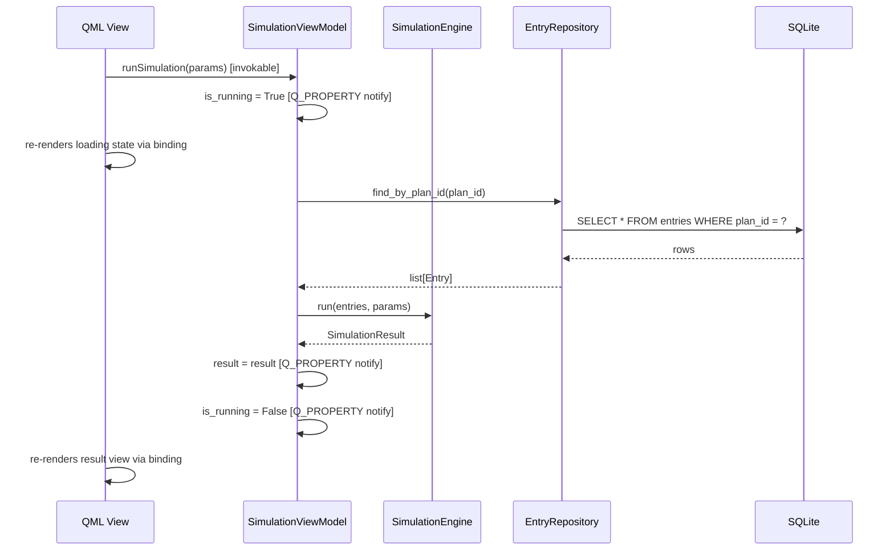
```mermaid
sequenceDiagram
    participant QML as QML View
    participant VM as SimulationViewModel
    participant SE as SimulationEngine
    participant Repo as EntryRepository
    participant DB as SQLite

    QML->>VM: runSimulation(params) [invokable]
    VM->>VM: is_running = True [Q_PROPERTY notify]
    QML->>QML: re-renders loading state via binding
    VM->>Repo: find_by_plan_id(plan_id)
    Repo->>DB: SELECT * FROM entries WHERE plan_id = ?
    DB-->>Repo: rows
    Repo-->>VM: list[Entry]
    VM->>SE: run(entries, params)
    SE-->>VM: SimulationResult
    VM->>VM: result = result [Q_PROPERTY notify]
    VM->>VM: is_running = False [Q_PROPERTY notify]
    QML->>QML: re-renders result view via binding
```

---

## 4. Tech Stack

### 4.1 Decision Matrix

| Layer | Technology | Rationale |
|-------|-----------|-----------|
| Desktop Runtime | **PySide6 (Qt 6)** | Official Qt bindings for Python; cross-platform native windows, menus, file dialogs; no Node.js or browser engine required. |
| UI Language | **QML** | Declarative, GPU-accelerated UI; property bindings replace manual event wiring; Qt Quick Charts is first-class; hot-reloadable in dev. |
| Application Language | **Python 3.12** | Concise for domain/business logic; excellent date arithmetic via `datetime` stdlib; rich ecosystem for future ML/analytics extensions. |
| Database | **SQLite** via **SQLAlchemy 2 (Core)** | Standard library-adjacent; sync API fits Qt's event loop naturally; SQLAlchemy Core gives typed queries without a heavy ORM. |
| Migrations | **Alembic** | Production-grade migration engine for SQLAlchemy; auto-generates migration scripts; supports downgrade paths. |
| Domain Validation | **Pydantic v2** | Data classes with runtime type validation; used for domain entities and for validating user-supplied data before DB writes. |
| Date Logic | **Python `datetime` + `dateutil`** | `datetime` for arithmetic; `dateutil.relativedelta` for month-accurate monthly recurrence; no third-party date library needed. |
| Charts | **Qt Quick Charts (PySide6.QtCharts)** | Native Qt chart types (SplineSeries, BarSeries, AreaSeries); integrates directly into QML without a JS bridge. |
| Async work | **`QThreadPool` + `QRunnable`** | Long-running simulations are offloaded to a worker thread via Qt's thread pool; result is signalled back to the main thread safely. |
| CSV/Excel import | **`openpyxl`** | Reads `.xlsx` files; the date pattern column is treated as a plain string so no special encoding is needed. `.csv` files are parsed with the Python `csv` stdlib module. |
| Exchange rate API | **`httpx`** | Optional async HTTP client for fetching live exchange rates from a public API. Runs in a `QRunnable` worker; result is written to the local DB as a regular `ExchangeRate` row with `source = "api"`. |
| Testing | **pytest + pytest-qt + hypothesis** | `pytest` for unit tests; `pytest-qt` for ViewModel and widget tests; `hypothesis` for property-based testing of the date pattern parser. |
| Packaging | **PyInstaller + `pyinstaller-hooks-contrib`** | Single-folder or one-file distribution; no Python installation required on end-user machines; supports macOS `.app`, Windows `.exe`, Linux binary. |
| Installer | **`create-dmg` (macOS) / Inno Setup (Windows) / AppImageTool (Linux)** | Wraps the PyInstaller output in a native installer format. |
| Internationalisation | **Qt Linguist (`pyside6-lupdate` / `pyside6-lrelease`)** | Extracts `qsTr()` strings into `.ts` source files; compiles them to binary `.qm` files loaded at runtime by `QTranslator`. Live UI retranslation via `QQmlEngine.retranslate()`. |

### 4.2 Project Structure

```
cash-flow-planner-app/
├── pyproject.toml                 # Project metadata, dependencies, poe tasks (PEP 621)
├── requirements.txt               # Pinned dependencies for reproducible builds
├── alembic.ini                    # Alembic migration config
├── main.py                        # Application entry point
├── i18n/                          # Qt Linguist translation source files
│   ├── app_en.ts                  # English (source)
│   ├── app_fr.ts                  # French
│   ├── app_ru.ts                  # Russian
│   ├── app_es.ts                  # Spanish
│   └── app_de.ts                  # German
├── resources/
│   ├── resources.qrc              # Qt resource file (icons, .qm files, manual PDFs)
│   ├── icons/                     # SVG/PNG icons
│   ├── manual/                    # Generated user-manual PDFs (bundled via .qrc)
│   └── i18n/                      # Compiled .qm binaries (generated, not committed)
├── src/
│   ├── app/                       # Application layer (ViewModels, Qt models)
│   │   ├── viewmodels/
│   │   │   ├── plan_vm.py         # PlanViewModel (QObject)
│   │   │   ├── plan_import_vm.py  # PlanImportViewModel (QObject) — .ftplan import preview + confirm
│   │   │   ├── entries_vm.py      # EntriesViewModel (QObject)
│   │   │   ├── simulation_vm.py   # SimulationViewModel (QObject)
│   │   │   ├── settings_vm.py     # SettingsViewModel (QObject) — theme, language, live rates, user manual
│   │   │   ├── currency_vm.py     # CurrencyViewModel (QObject) — global exchange rate CRUD
│   │   │   └── import_vm.py       # ImportViewModel (QObject) — CSV/Excel import flow
│   │   ├── models/                # Qt list models (QAbstractListModel)
│   │   │   ├── entry_list_model.py
│   │   │   ├── snapshot_list_model.py
│   │   │   └── exchange_rate_list_model.py
│   │   ├── workers/               # QRunnable workers
│   │   │   ├── simulation_worker.py
│   │   │   ├── import_worker.py
│   │   │   ├── export_worker.py
│   │   │   ├── plan_export_worker.py
│   │   │   └── plan_import_worker.py
│   │   ├── i18n/
│   │   │   ├── manual_content.py    # User manual chapter/block content (FR-23)
│   │   │   └── methodology_content.py
│   │   └── user_manual.py           # qrc resolve + cache materialize for PDF viewer
│   ├── domain/                    # Business logic (pure Python, no Qt)
│   │   ├── entities.py            # Pydantic domain models (Plan, Entry, etc.)
│   │   ├── date_pattern.py        # DatePattern parser and expander
│   │   ├── simulation_engine.py   # Core simulation algorithm
│   │   ├── currency_normalizer.py
│   │   └── template_service.py    # Bundled forecast template load + validation
│   ├── templates/                 # Bundled forecast template JSON (package data)
│   │   ├── schema.json
│   │   ├── saas_startup.json
│   │   ├── consulting_firm.json
│   │   └── retail_shop.json
│   ├── data/                      # Data layer
│   │   ├── database.py            # SQLAlchemy engine + session factory
│   │   ├── schema.py              # SQLAlchemy table definitions
│   │   ├── migrations/            # Alembic auto-generated migrations
│   │   └── repositories/
│   │       ├── plan_repo.py
│   │       ├── entry_repo.py
│   │       └── exchange_rate_repo.py
│   ├── export/                    # Export services
│   │   ├── csv_exporter.py
│   │   ├── pdf_exporter.py        # Executive PDF report (ReportLab)
│   │   ├── manual_pdf_exporter.py # User manual PDF (FR-23)
│   │   ├── manual_pdf_styles.py
│   │   ├── cash_bridge.py         # Monthly opening/closing balance aggregation
│   │   ├── context_builder.py     # ExportContext assembly helpers
│   │   ├── rate_selection.py      # Plan-scoped FX rate filtering for export
│   │   ├── models.py              # ExportContext DTO
│   │   └── plan_exporter.py       # Versioned .ftplan JSON bundle export
│   └── integrations/              # Optional external integrations
│       ├── import_service.py      # CSV / Excel entry import (openpyxl + csv)
│       ├── plan_import_service.py # .ftplan parse, validate, transactional import
│       └── exchange_rate_fetcher.py  # Live rate fetch via httpx (optional)
├── qml/                           # All QML source files
│   ├── main.qml                   # Root ApplicationWindow + gear-icon toolbar button
│   ├── pages/
│   │   ├── PlanListPage.qml
│   │   ├── PlanDetailLayout.qml   # 2-tab layout: Entries + Simulation
│   │   ├── EntriesPage.qml
│   │   ├── SimulationPage.qml
│   │   └── SettingsPage.qml       # Top-level page: theme, language, exchange rates
│   └── components/
│       ├── EntryForm.qml
│       ├── EntryFormDrawer.qml
│       ├── DatePatternInput.qml
│       ├── DatePicker.qml
│       ├── CurrencyRateEditor.qml  # Global exchange rate table
│       ├── MonthlyTableView.qml
│       ├── BalanceChart.qml
│       ├── DeficitBanner.qml
│       ├── SimulationControls.qml
│       ├── WhatIfPanel.qml        # Temporary entry overrides for what-if runs
│       ├── ImportDialog.qml       # CSV/Excel file picker + column-mapping step
│       ├── PlanImportDialog.qml   # .ftplan import preview + rate-conflict resolution
│       └── TemplatePickerDialog.qml  # Bundled template picker for new forecasts
└── tests/
    ├── unit/                      # pytest unit tests (pure Python, no Qt)
    │   ├── test_date_pattern.py
    │   ├── test_simulation_engine.py
    │   ├── test_currency_normalizer.py
    │   └── test_template_service.py
    ├── integration/               # pytest-qt ViewModel + DB tests
    │   ├── test_plan_vm.py
    │   └── test_simulation_vm.py
    └── e2e/                       # pytest-qt full app tests (offscreen)
        ├── test_simulation_e2e.py
        └── test_multi_currency.py
```

---

## 5. Domain Model

### 5.1 Core Entities

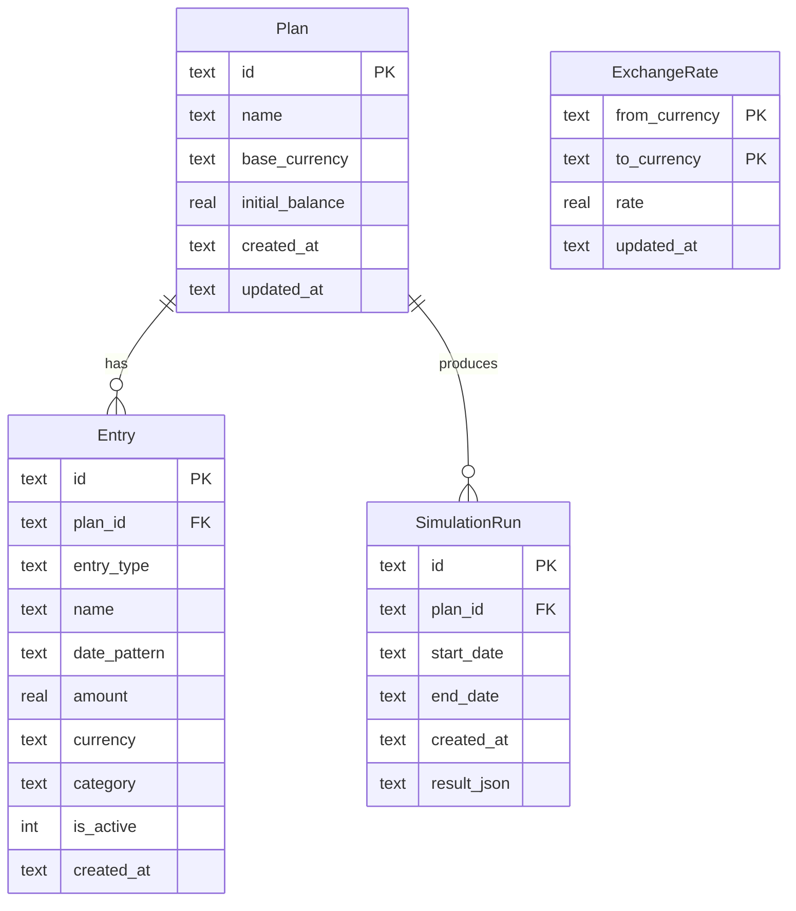
```mermaid
erDiagram
    Plan {
        text id PK
        text name
        text base_currency
        real initial_balance
        text created_at
        text updated_at
    }

    Entry {
        text id PK
        text plan_id FK
        text entry_type
        text name
        text date_pattern
        real amount
        text currency
        text category
        int is_active
        text created_at
    }

    ExchangeRate {
        text from_currency PK
        text to_currency PK
        real rate
        text updated_at
    }

    SimulationRun {
        text id PK
        text plan_id FK
        text start_date
        text end_date
        text created_at
        text result_json
    }

    Plan ||--o{ Entry : "has"
    Plan ||--o{ SimulationRun : "produces"
```

### 5.2 Entity Descriptions

**Plan** — The top-level container for a financial scenario. A user can maintain multiple plans (e.g., "Conservative 2026", "With new job"). Each plan has a base currency to which all multi-currency amounts are normalized.

**Entry** — A single income or expense definition. The `entry_type` field is an enum: `income | expense`. The `date_pattern` string encodes recurrence using the pattern syntax described in Section 6. The `category` field is freeform text, used for grouping in reports.

**ExchangeRate** — A user-defined exchange rate between two currencies stored in a single **global** table shared by all plans. The primary key is `(from_currency, to_currency)`; upserts replace the previous value for that pair. Rates are applied during simulation to normalize all amounts to the plan's `base_currency`.

**SimulationRun** — A persisted snapshot of a simulation result. Stored as compressed JSON so the user can revisit past projections without re-running the engine.

---

## 6. Date Pattern System

### 6.1 Pattern Specification

The date pattern is a string in the format `DD.MM.YYYY` where each component may be replaced by `..` (two dots) to indicate "every value of this component."

| Pattern | Example | Meaning |
|---------|---------|---------|
| `...` | `...` | Daily — fires every single day in the simulation range. |
| `DD..` | `10..` | Monthly — fires on day DD of every month. |
| `DD.MM.` | `10.02.` | Yearly — fires on DD/MM of every year. |
| `DD.MM.YYYY` | `10.02.2026` | One-time — fires exactly once on that date. |

Dots that are `..` (omitted) act as wildcards. A pattern with no wildcards is a pinpoint date.

### 6.2 Pattern Grammar (EBNF)

```
pattern      ::= day_part "." month_part "." year_part
day_part     ::= wildcard | day_number
month_part   ::= wildcard | month_number
year_part    ::= wildcard | year_number
wildcard     ::= "."
day_number   ::= digit digit?           (* 1–31 *)
month_number ::= digit digit?           (* 1–12 *)
year_number  ::= digit digit digit digit
digit        ::= "0" | "1" | ... | "9"
```

### 6.3 Pattern State Machine

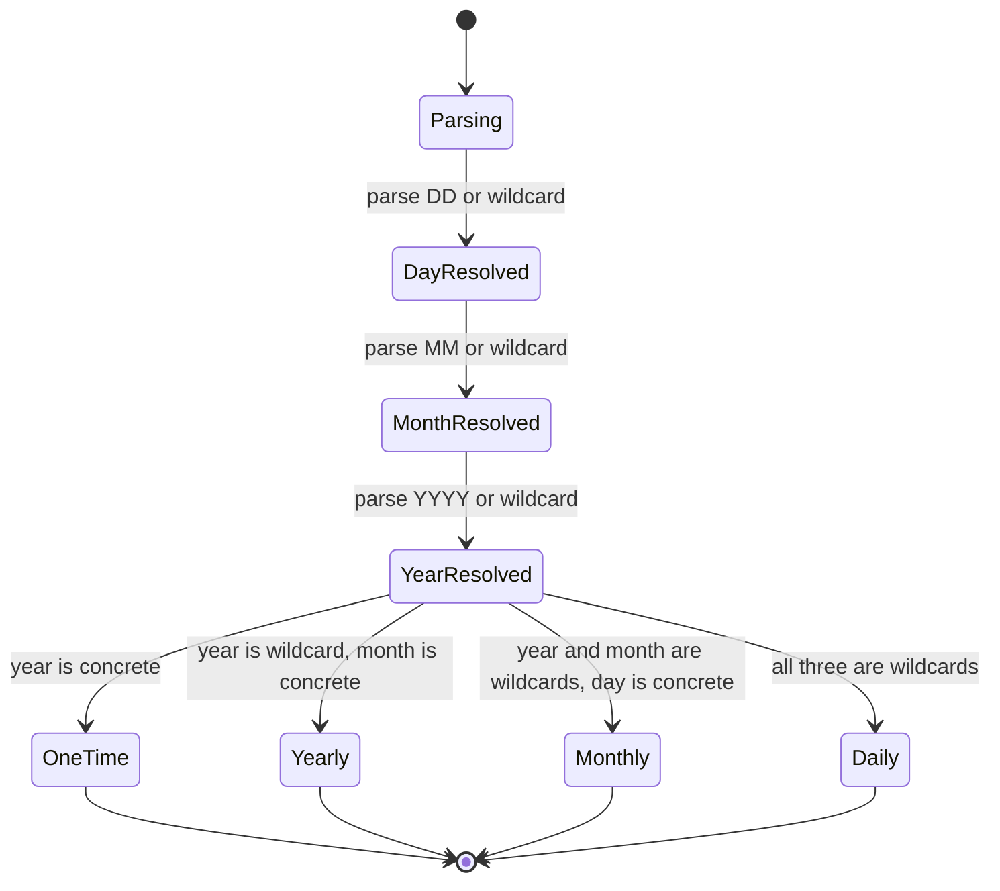
```mermaid
stateDiagram-v2
    [*] --> Parsing
    Parsing --> DayResolved: parse DD or wildcard
    DayResolved --> MonthResolved: parse MM or wildcard
    MonthResolved --> YearResolved: parse YYYY or wildcard

    YearResolved --> OneTime: year is concrete
    YearResolved --> Yearly: year is wildcard, month is concrete
    YearResolved --> Monthly: year and month are wildcards, day is concrete
    YearResolved --> Daily: all three are wildcards

    OneTime --> [*]
    Yearly --> [*]
    Monthly --> [*]
    Daily --> [*]
```

### 6.4 Event Expansion Algorithm

For a given simulation window `[startDate, endDate]` and an `Entry`, the expander produces a sorted list of `FinancialEvent` instances:

```
function expand(entry, startDate, endDate):
  events = []
  pattern = parse(entry.datePattern)

  switch pattern.type:
    case DAILY:
      cursor = startDate
      while cursor <= endDate:
        events.push(event(entry, cursor))
        cursor = addDays(cursor, 1)

    case MONTHLY:
      cursor = setDay(startOfMonth(startDate), pattern.day)
      if cursor < startDate: cursor = addMonths(cursor, 1)
      while cursor <= endDate:
        events.push(event(entry, cursor))
        cursor = addMonths(cursor, 1)

    case YEARLY:
      cursor = setMonth(setDay(startOfYear(startDate), pattern.day), pattern.month)
      if cursor < startDate: cursor = addYears(cursor, 1)
      while cursor <= endDate:
        events.push(event(entry, cursor))
        cursor = addYears(cursor, 1)

    case ONE_TIME:
      if pattern.date >= startDate && pattern.date <= endDate:
        events.push(event(entry, pattern.date))

  return events
```

### 6.5 Edge Cases

| Case | Handling |
|------|----------|
| `31..` in a month with <31 days | Skip that month (day does not exist). |
| `29.02.` in a non-leap year | Skip that year. |
| Start date > pattern's first occurrence | Advance cursor forward to next valid occurrence before collecting. |
| Simulation window of 0 days | Return empty list. |

---

## 7. Data Layer

### 7.1 SQLite Schema (SQLAlchemy Core)

```python
# src/data/schema.py
from sqlalchemy import (
    MetaData, Table, Column,
    String, Float, Integer, Boolean, Text
)
import uuid

metadata = MetaData()

plans = Table("plans", metadata,
    Column("id",              String, primary_key=True, default=lambda: str(uuid.uuid4())),
    Column("name",            String, nullable=False),
    Column("base_currency",   String, nullable=False, default="USD"),
    Column("initial_balance", Float,  nullable=False, default=0.0),
    Column("created_at",      String, nullable=False),
    Column("updated_at",      String, nullable=False),
)

entries = Table("entries", metadata,
    Column("id",           String,  primary_key=True, default=lambda: str(uuid.uuid4())),
    Column("plan_id",      String,  nullable=False),   # FK → plans.id CASCADE DELETE
    Column("entry_type",   String,  nullable=False),   # 'income' | 'expense'
    Column("name",         String,  nullable=False),
    Column("date_pattern", String,  nullable=False),
    Column("amount",       Float,   nullable=False),
    Column("currency",     String,  nullable=False),
    Column("category",     String),
    Column("is_active",    Boolean, nullable=False, default=True),
    Column("created_at",   String,  nullable=False),
)

exchange_rates = Table("exchange_rates", metadata,
    Column("from_currency", String, nullable=False),
    Column("to_currency",   String, nullable=False),
    Column("rate",          Float,  nullable=False),
    Column("updated_at",    String, nullable=False),
    PrimaryKeyConstraint("from_currency", "to_currency"),
    # Global table — no plan_id FK. All plans share one rate set.
    # Upsert: ON CONFLICT(from_currency, to_currency) DO UPDATE SET rate=..., updated_at=...
)

simulation_runs = Table("simulation_runs", metadata,
    Column("id",          String, primary_key=True, default=lambda: str(uuid.uuid4())),
    Column("plan_id",     String, nullable=False),
    Column("start_date",  String, nullable=False),
    Column("end_date",    String, nullable=False),
    Column("result_json", Text,   nullable=False),
    Column("created_at",  String, nullable=False),
)

audit_log = Table("audit_log", metadata,
    Column("id",          String, primary_key=True, default=lambda: str(uuid.uuid4())),
    Column("plan_id",     String, nullable=False),   # FK → plans.id CASCADE DELETE
    Column("entity_type", String, nullable=False),   # 'plan' | 'entry' | 'rate'
    Column("entity_id",   String, nullable=False),
    Column("action",      String, nullable=False),    # 'create' | 'update' | 'delete'
    Column("summary",     Text,   nullable=False),   # human-readable change description
    Column("timestamp",   String, nullable=False),   # ISO-8601 UTC
    Index("ix_audit_log_plan_id", "plan_id"),
)
```

`SqlitePlanRepository` and `SqliteEntryRepository` append audit records on create, update, and delete. `SqliteAuditLogRepository` exposes `append` and `list_by_plan` (newest-first). Simulation runs are not logged. The audit log is read-only in the UI via `AuditLogViewModel`.

### 7.2 Repository Pattern

Each entity has a dedicated repository class. Repositories are the **only** classes that talk to the database. Business logic never calls the session directly.

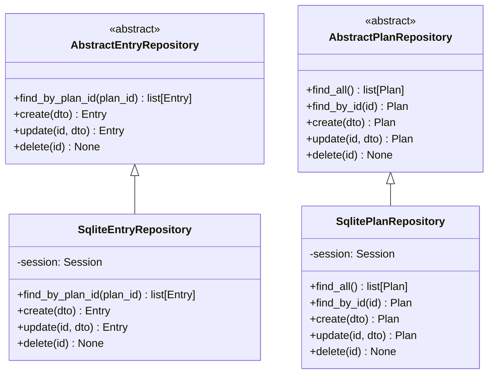
```mermaid
classDiagram
    class AbstractEntryRepository {
        <<abstract>>
        +find_by_plan_id(plan_id) list[Entry]
        +create(dto) Entry
        +update(id, dto) Entry
        +delete(id) None
    }

    class SqliteEntryRepository {
        -session: Session
        +find_by_plan_id(plan_id) list[Entry]
        +create(dto) Entry
        +update(id, dto) Entry
        +delete(id) None
    }

    class AbstractPlanRepository {
        <<abstract>>
        +find_all() list[Plan]
        +find_by_id(id) Plan
        +create(dto) Plan
        +update(id, dto) Plan
        +delete(id) None
    }

    class SqlitePlanRepository {
        -session: Session
        +find_all() list[Plan]
        +find_by_id(id) Plan
        +create(dto) Plan
        +update(id, dto) Plan
        +delete(id) None
    }

    AbstractEntryRepository <|-- SqliteEntryRepository
    AbstractPlanRepository <|-- SqlitePlanRepository
```

The abstract base class layer exists for testability: unit tests inject an in-memory `dict`-backed implementation without touching the file system.

### 7.3 Migration Strategy

Alembic manages incremental schema migrations. On application start, `main.py` calls `alembic upgrade head` programmatically before opening the Qt window. This ensures the database is always in sync with the application version, even after an auto-update.

```
src/data/migrations/
├── env.py                         # Alembic environment (auto-generated)
├── script.py.mako                 # Migration template
└── versions/
    ├── 0001_initial_schema.py
    ├── 0002_add_exchange_rates.py
    ├── 0003_add_simulation_runs.py
    ├── 0004_...py                 # (Story 9 additions)
    └── 0005_global_exchange_rates.py  # Drop plan_id FK; composite PK (from, to)
    └── 0007_add_audit_log.py          # audit_log table (FR-21)
```

---

## 8. Business Logic Layer

### 8.1 Component Overview

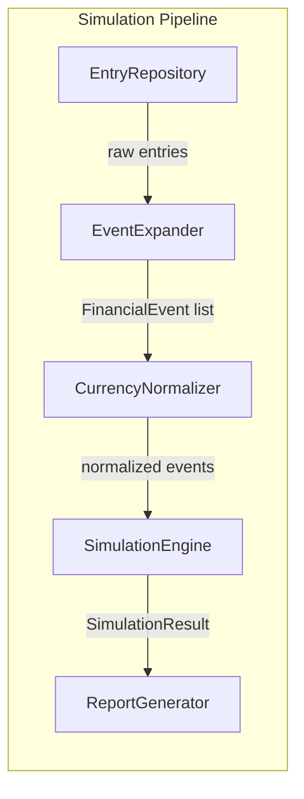
```mermaid
flowchart LR
    subgraph SimulationPipeline [Simulation Pipeline]
        EP[EntryRepository] -->|raw entries| EX[EventExpander]
        EX -->|FinancialEvent list| CN[CurrencyNormalizer]
        CN -->|normalized events| SE[SimulationEngine]
        SE -->|SimulationResult| RG[ReportGenerator]
    end
```

### 8.2 FinancialEvent (Value Object)

A `FinancialEvent` is an immutable value object representing a single monetary transaction on a specific date. It is produced by the `EventExpander` and consumed by the `SimulationEngine`. Implemented as a frozen Pydantic model to guarantee immutability.

```python
# src/domain/entities.py
from __future__ import annotations
from datetime import date
from enum import Enum
from typing import Optional
from pydantic import BaseModel, ConfigDict

class EntryType(str, Enum):
    INCOME  = "income"
    EXPENSE = "expense"

class FinancialEvent(BaseModel):
    model_config = ConfigDict(frozen=True)

    entry_id:   str
    entry_name: str
    date:       date
    type:       EntryType
    amount:     float        # original amount in entry's currency
    currency:   str
    category:   Optional[str] = None

class NormalizedEvent(BaseModel):
    model_config = ConfigDict(frozen=True)

    entry_id:          str
    entry_name:        str
    date:              date
    type:              EntryType
    normalized_amount: float   # converted to plan's base currency
    base_currency:     str
    category:          Optional[str] = None
```

### 8.3 SimulationEngine

The engine receives a sorted list of normalized `NormalizedEvent` objects and computes running balance at each point.

```python
# src/domain/entities.py (continued)
from dataclasses import dataclass, field

@dataclass(frozen=True)
class SimulationParams:
    start_date:      date
    end_date:        date
    initial_balance: float
    base_currency:   str

@dataclass(frozen=True)
class DailyBalance:
    date:            date
    events:          tuple[NormalizedEvent, ...]
    day_income:      float
    day_expense:     float
    closing_balance: float

@dataclass(frozen=True)
class MonthlySnapshot:
    year:            int
    month:           int    # 1–12
    total_income:    float
    total_expense:   float
    net_flow:        float
    closing_balance: float
    deficit:         bool

@dataclass(frozen=True)
class SimulationResult:
    plan_id:             str
    params:              SimulationParams
    daily_balances:      tuple[DailyBalance, ...]
    monthly_snapshots:   tuple[MonthlySnapshot, ...]
    first_deficit_date:  Optional[date]
    first_deficit_event: Optional[NormalizedEvent]
    final_balance:       float
    total_income:        float
    total_expense:       float
```

**Algorithm:**

1. Fetch all active entries for the plan (substituting any what-if overrides in memory — see Section 9.1).
2. Expand each entry into `list[FinancialEvent]` for `[start_date, end_date]`.
3. Normalize all event amounts to `base_currency` using applicable exchange rates.
4. Group events by date. For each day, sum all income events into a single **daily income total** and all expense events into a single **daily expense total**. Individual sub-entry details are retained in `DailyBalance.events` for potential drill-down but are not surfaced in the primary UI.
5. Walk days in chronological order, accumulating `closing_balance`. Record one `DailyBalance` per day.
6. Aggregate `DailyBalance` records into `MonthlySnapshot` records.
7. Record `first_deficit_date` on the first day where `closing_balance < 0`.
8. Return `SimulationResult`.

> **Design decision (Q1):** Daily events are collapsed to a **daily total** at the display level for performance and readability. The `DailyBalance` struct exposes `day_income` and `day_expense` as the canonical view; the underlying `events` tuple is available for future drill-down features but is not shown in v1 UI.

**Time complexity:** O(N × D) where N is the number of active entries and D is the simulation duration in days. For a 10-year simulation with 50 daily entries (~3 650 days), this remains well under 2 seconds. The engine runs in a `QRunnable` worker thread so it never blocks the Qt event loop.

### 8.4 DatePattern Module

```python
# src/domain/date_pattern.py
from __future__ import annotations
from datetime import date
from dataclasses import dataclass
from enum import Enum
from typing import Optional

class PatternType(str, Enum):
    DAILY    = "daily"
    MONTHLY  = "monthly"
    YEARLY   = "yearly"
    ONE_TIME = "one-time"

@dataclass(frozen=True)
class ParsedPattern:
    type:  PatternType
    day:   Optional[int] = None
    month: Optional[int] = None
    year:  Optional[int] = None

def parse_pattern(raw: str) -> ParsedPattern: ...
def expand_pattern(entry: "Entry", start: date, end: date) -> list["FinancialEvent"]: ...
def describe_pattern(pattern: ParsedPattern) -> str: ...
# e.g. describe_pattern(ParsedPattern(MONTHLY, day=10)) → "Monthly on the 10th"
```

### 8.5 CurrencyNormalizer

```python
# src/domain/currency_normalizer.py
from datetime import date

def normalize(
    event: FinancialEvent,
    base_currency: str,
    exchange_rates: list[ExchangeRate],
) -> float:
    """
    Returns event.amount converted to base_currency using the most recent
    ExchangeRate with effective_date <= event.date.
    Raises CurrencyConversionError if no applicable rate exists and
    event.currency != base_currency.
    """
    ...
```

### 8.6 SuggestionEngine (FR-24)

Pure-Python analysis in `src/domain/suggestions.py` ranks actionable hints after a projection. Registered **analyzer** callables (`suggestion_deficit.py`, `suggestion_surplus.py`) emit `Suggestion` objects with English copy plus `title_template` / `detail_template` metadata for i18n. The engine deduplicates by `id`, sorts by `priority` then impact, and caps output at ten items.

```python
# src/domain/suggestions.py (excerpt)
@dataclass(frozen=True)
class Suggestion:
    id: str
    kind: SuggestionKind
    priority: int
    title: str
    detail: str
    impact_amount: float | None
    impact_currency: str
    related_entry_id: str | None = None
    suggested_change: SuggestedChange | None = None
    title_template: str = ""
    title_args: tuple[str, ...] = ()
    detail_template: str = ""
    detail_args: tuple[str, ...] = ()
```

Suggestions are read-only analysis — they never mutate the database. Applying a hint is explicit (scenario override or cash-flow edit).

### 8.7 ExpenseAnalyticsEngine (FR-26)

Pure-Python rollups in `src/domain/expense_analytics.py` take recorded expenses, a date range, a display currency, and exchange rates. The engine filters expenses to the inclusive range, normalizes each amount to the display currency, and produces sorted `ExpenseAnalyticsBucket` tuples for **by_name**, **by_category**, and **by_place**. Uncategorized expenses and expenses without a place use stable default labels. The `group_top_n` helper merges buckets beyond the chart limit into an **Other** row for QML bar charts.

---

## 9. Application Layer

### 9.1 ViewModel Architecture

ViewModels are `QObject` subclasses registered into the QML context via `setContextProperty`. They expose state as `Q_PROPERTY` with `NOTIFY` signals, and actions as `@Slot` methods. QML binds to properties declaratively — no manual update calls needed.

```python
# src/app/viewmodels/simulation_vm.py
from PySide6.QtCore import QObject, Property, Signal, Slot, QThreadPool
from src.domain.simulation_engine import SimulationEngine
from src.data.repositories.entry_repo import SqliteEntryRepository

class SimulationViewModel(QObject):
    isRunningChanged  = Signal()
    resultChanged     = Signal()
    errorChanged      = Signal()

    def __init__(self, entry_repo: SqliteEntryRepository, parent=None):
        super().__init__(parent)
        self._is_running = False
        self._result     = None
        self._error      = None
        self._repo       = entry_repo

    @Property(bool, notify=isRunningChanged)
    def isRunning(self) -> bool:
        return self._is_running

    @Property("QVariant", notify=resultChanged)
    def result(self):
        return self._result   # serialized dict — QML reads it as JS object

    @Property(str, notify=errorChanged)
    def error(self) -> str:
        return self._error or ""

    @Slot(str, "QVariant")
    def runSimulation(self, plan_id: str, params: dict) -> None:
        self._is_running = True
        self.isRunningChanged.emit()
        worker = SimulationWorker(self._repo, plan_id, params)
        worker.signals.finished.connect(self._on_result)
        worker.signals.error.connect(self._on_error)
        QThreadPool.globalInstance().start(worker)

    # --- What-if mode ---
    # what_if_overrides is a dict keyed by entry_id with partial overrides
    # (amount, date_pattern, is_active). Overrides are applied in-memory
    # inside SimulationWorker before expansion; they are never written to DB.

    @Slot(str, "QVariant", "QVariant")
    def runWhatIf(self, plan_id: str, params: dict, overrides: dict) -> None:
        """Run a simulation with temporary entry overrides. The saved plan is unchanged."""
        self._is_running = True
        self.isRunningChanged.emit()
        worker = SimulationWorker(self._repo, plan_id, params, what_if_overrides=overrides)
        worker.signals.finished.connect(self._on_result)
        worker.signals.error.connect(self._on_error)
        QThreadPool.globalInstance().start(worker)

    def _on_result(self, result: dict) -> None:
        self._result     = result
        self._is_running = False
        self.resultChanged.emit()
        self.isRunningChanged.emit()

    def _on_error(self, message: str) -> None:
        self._error      = message
        self._is_running = False
        self.errorChanged.emit()
        self.isRunningChanged.emit()
```

### 9.2 Qt List Models

Tables and lists in QML are backed by `QAbstractListModel` subclasses, which provide efficient row-level change notifications (insert/remove/update) without re-rendering the whole list.

```python
# src/app/models/entry_list_model.py
from PySide6.QtCore import QAbstractListModel, Qt, QModelIndex
from src.domain.entities import Entry

class EntryListModel(QAbstractListModel):
    NAME_ROLE         = Qt.UserRole + 1
    DATE_PATTERN_ROLE = Qt.UserRole + 2
    AMOUNT_ROLE       = Qt.UserRole + 3
    CURRENCY_ROLE     = Qt.UserRole + 4
    TYPE_ROLE         = Qt.UserRole + 5
    CATEGORY_ROLE     = Qt.UserRole + 6
    IS_ACTIVE_ROLE    = Qt.UserRole + 7

    def __init__(self, entries: list[Entry] = None, parent=None):
        super().__init__(parent)
        self._entries = entries or []

    def rowCount(self, parent=QModelIndex()) -> int:
        return len(self._entries)

    def data(self, index: QModelIndex, role: int = Qt.DisplayRole):
        if not index.isValid(): return None
        entry = self._entries[index.row()]
        return {
            self.NAME_ROLE:         entry.name,
            self.DATE_PATTERN_ROLE: entry.date_pattern,
            self.AMOUNT_ROLE:       entry.amount,
            self.CURRENCY_ROLE:     entry.currency,
            self.TYPE_ROLE:         entry.type.value,
            self.CATEGORY_ROLE:     entry.category or "",
            self.IS_ACTIVE_ROLE:    entry.is_active,
        }.get(role)

    def roleNames(self) -> dict:
        return {
            self.NAME_ROLE:         b"name",
            self.DATE_PATTERN_ROLE: b"datePattern",
            self.AMOUNT_ROLE:       b"amount",
            self.CURRENCY_ROLE:     b"currency",
            self.TYPE_ROLE:         b"entryType",
            self.CATEGORY_ROLE:     b"category",
            self.IS_ACTIVE_ROLE:    b"isActive",
        }
```

### 9.3 Context Registration (main.py)

**`SettingsViewModel` Q_PROPERTY summary:**

| Property | Type | Writable | Notes |
|----------|------|----------|-------|
| `darkMode` | `bool` | `setDarkMode(bool)` | Persisted in `QSettings` |
| `liveRatesEnabled` | `bool` | `setLiveRatesEnabled(bool)` | `QSettings` key `exchange_rate_api_enabled` |
| `liveRatesFetchAvailable` | `bool` | — | False during the 1-minute cooldown or after 10 live fetches on the same calendar day; always `True` when mock rates are enabled |
| `secondsUntilLiveRatesFetch` | `int` | — | Seconds until the next allowed live fetch (0 when available or when mock rates are enabled) |
| `liveRatesDailyLimitReached` | `bool` | — | True when the 10-per-day live fetch cap is reached |
| `devModeEnabled` | `bool` | constant | Reflects `--dev` flag at startup; never changes at runtime |
| `useMockExchangeRates` | `bool` | `setUseMockExchangeRates(bool)` | Only settable when `devModeEnabled`; ignored in production |
| `language` | `str` | `setLanguage(str)` | ISO 639-1 code; `QSettings` key `language`; default `"en"` |

```python
# main.py (abridged)
from PySide6.QtGui import QGuiApplication
from PySide6.QtQml import QQmlApplicationEngine
from PySide6.QtCore import QSettings, QTranslator
from src.data.database import create_session
from src.data.repositories.plan_repo import SqlitePlanRepository
from src.data.repositories.entry_repo import SqliteEntryRepository
from src.data.repositories.exchange_rate_repo import SqliteExchangeRateRepository
from src.app.viewmodels.plan_vm import PlanViewModel
from src.app.viewmodels.entries_vm import EntriesViewModel
from src.app.viewmodels.simulation_vm import SimulationViewModel
from src.app.viewmodels.settings_vm import SettingsViewModel
from src.app.viewmodels.currency_vm import CurrencyViewModel

app     = QGuiApplication(sys.argv)
session = create_session()

# Install translator before engine is created so QML picks it up immediately.
lang        = QSettings().value("language", "en")
translator  = QTranslator(app)
if translator.load(f":/i18n/app_{lang}.qm"):
    app.installTranslator(translator)

engine = QQmlApplicationEngine()

plan_vm     = PlanViewModel(SqlitePlanRepository(session))
entry_vm    = EntriesViewModel(SqliteEntryRepository(session))
sim_vm      = SimulationViewModel(SqliteEntryRepository(session))
settings_vm = SettingsViewModel()
currency_vm = CurrencyViewModel(SqliteExchangeRateRepository(session))

# Live language switching: swap translator and call engine.retranslate()
settings_vm.languageChanged.connect(lambda lang: _swap_translator(app, engine, lang))

engine.rootContext().setContextProperty("planViewModel",       plan_vm)
engine.rootContext().setContextProperty("entriesViewModel",    entry_vm)
engine.rootContext().setContextProperty("simulationViewModel", sim_vm)
engine.rootContext().setContextProperty("settingsViewModel",   settings_vm)
engine.rootContext().setContextProperty("ratesViewModel",      currency_vm)

engine.load("qml/main.qml")
sys.exit(app.exec())
```

---

## 10. Presentation Layer

### 10.1 QML Navigation Structure

Qt Quick uses a `StackView` for page navigation. Pages are pushed/popped imperatively from QML; no URL router is needed.

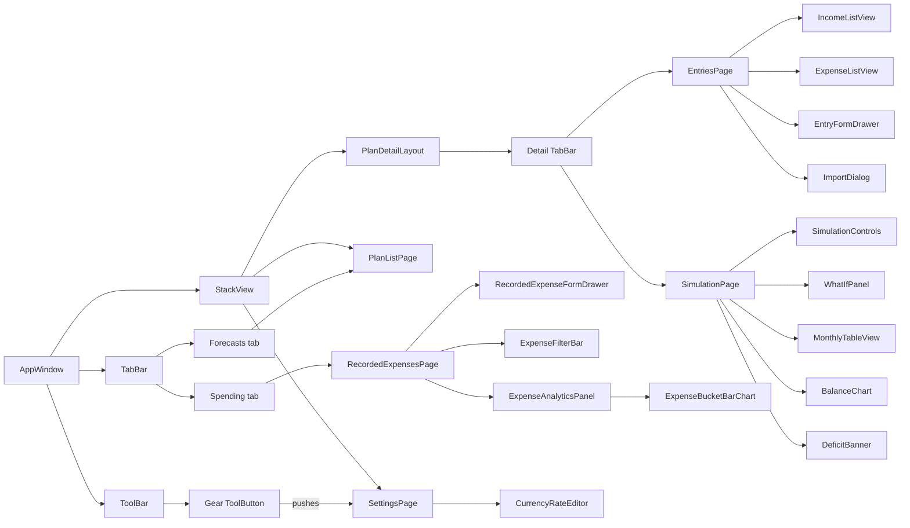
```mermaid
flowchart LR
    AppWindow --> ToolBar
    AppWindow --> TabBar
    AppWindow --> StackView
    ToolBar --> GearButton["Gear ToolButton"]
    GearButton -->|"pushes"| SettingsPage

    TabBar --> ForecastsTab["Forecasts tab"]
    TabBar --> SpendingTab["Spending tab"]
    ForecastsTab --> PlanListPage
    SpendingTab --> RecordedExpensesPage

    StackView --> PlanListPage
    StackView --> PlanDetailLayout
    StackView --> SettingsPage

    PlanDetailLayout --> TabBar2["Detail TabBar"]
    TabBar2 --> EntriesPage
    TabBar2 --> SimulationPage

    RecordedExpensesPage --> RecordedExpenseFormDrawer
    RecordedExpensesPage --> ExpenseFilterBar
    RecordedExpensesPage --> ExpenseAnalyticsPanel
    ExpenseAnalyticsPanel --> ExpenseBucketBarChart

    EntriesPage --> IncomeListView
    EntriesPage --> ExpenseListView
    EntriesPage --> EntryFormDrawer

    SimulationPage --> SimulationControls
    SimulationPage --> WhatIfPanel
    SimulationPage --> MonthlyTableView
    SimulationPage --> BalanceChart
    SimulationPage --> DeficitBanner

    EntriesPage --> ImportDialog

    SettingsPage --> CurrencyRateEditor
```

### 10.2 Key QML Components

| Component | Responsibility |
|-----------|---------------|
| `EntryFormDrawer.qml` | Slide-in drawer for creating/editing an entry. Calls `entriesViewModel.validatePattern(text)` on each keystroke to show a live preview of the next 3 dates. |
| `DatePatternInput.qml` | Custom `TextField` that wraps pattern input. Shows a `Label` below it with the human-readable description returned by `entriesViewModel.describePattern`. |
| `MonthlyTableView.qml` | `TableView` bound to a `SnapshotListModel`. Rows where `deficit === true` use a red `Rectangle` background via a `delegate` property binding. |
| `BalanceChart.qml` | `ChartView` with an `AreaSeries` for the running balance. A horizontal `ValueAxis` line at y=0. The fill below zero uses a red gradient `LinearGradient`. Hovering the plot area shows a vertical guide snapped to the nearest daily point and a tooltip with the date (`dd MMM yy`) and closing balance in the simulation display currency. |
| `DeficitBanner.qml` | `Rectangle` banner — visible only when `simulationViewModel.result.firstDeficitDate` is non-null. Shows date, shortfall amount, and triggering entry name. |
| `CurrencyRateEditor.qml` | `TableView` of **global** exchange rates (no plan context) with inline editable `TextField` delegates. Lives inside `SettingsPage`. A "Fetch live rates" button triggers `simulationViewModel.fetchLiveRates()` (optional; hidden when live fetch is disabled in Settings). |
| `SimulationControls.qml` | Date range pickers (`CalendarView`), initial balance `TextField`, and a `Button` that calls `simulationViewModel.runSimulation`. The end-date picker clamps to today + 10 years. Disabled when `simulationViewModel.isRunning`. |
| `WhatIfPanel.qml` | Collapsible side panel listing all entries with inline override controls (amount field, active toggle). A "Run what-if" button calls `simulationViewModel.runWhatIf(planId, params, overrides)`. A "Clear overrides" action resets all fields without touching saved data. |
| `ImportDialog.qml` | File picker (CSV / XLSX) → column-mapping step → preview table → "Import" button calls `importViewModel.importFile(path, mapping)`. |
| `RecordedExpenseFormDrawer.qml` | Slide-in drawer for creating/editing a recorded expense. Three `LabelAutocompleteField` delegates call debounced `searchExpenseNames` / `searchCategories` / `searchPlaces` slots. |
| `ExpenseFilterBar.qml` | Search box, date-range presets (this month, last 30 days, YTD, custom), and clear-filters action. Syncs date range to `ExpenseAnalyticsViewModel` and `RecordedExpensesViewModel`. |
| `ExpenseAnalyticsPanel.qml` | Overview section with three horizontal bar charts bound to `expenseAnalyticsViewModel` series properties. |
| `ExpenseBucketBarChart.qml` | Reusable Qt Charts horizontal bar chart for a single analytics dimension; handles empty state and dynamic axis margins. |
| `LabelAutocompleteField.qml` | Reusable typeahead `TextField` with suggestion popup bound to a `LabelSuggestionModel`. |

### 10.3 UI/UX Principles

- **Live pattern preview** — as the user types in `DatePatternInput`, the ViewModel's `@Slot` `describe_pattern(text)` is called synchronously (no async needed — pure Python logic) and the result is shown as a hint label.
- **Thread-safe simulation** — the "Run" button disables via `enabled: !simulationViewModel.isRunning` binding while the worker thread computes. A `BusyIndicator` spins. No UI freezing.
- **Persistent state** — active plan ID is saved to `QSettings` (OS-native: `NSUserDefaults` on macOS, registry on Windows) so the user returns to the same plan after restart.
- **App-wide Settings** — a gear `ToolButton` in the persistent toolbar opens `SettingsPage` as a top-level stack entry. Settings (dark mode, language, exchange rates) are not scoped to any plan; they apply to the entire application.
- **Dark mode** — implemented via Qt's `Material` style palette. A `Switch` in `SettingsPage` toggles `Material.Dark / Material.Light` globally. Preference stored in `QSettings`.
- **Language switching** — a `ComboBox` in `SettingsPage` calls `settingsViewModel.setLanguage(code)`. The ViewModel swaps the active `QTranslator` and calls `engine.retranslate()` so the entire QML tree re-evaluates `qsTr()` bindings immediately — no app restart required. Selected language persisted in `QSettings`.
- **Top-level Spending tab** — a footer `TabBar` in `main.qml` switches between **Forecasts** (`StackView` with plan list and drill-down) and **Spending** (`RecordedExpensesPage`). Settings remains reachable from the toolbar on either tab (switching to Forecasts first when opened from Spending).

---

## 11. Data Flow

### 11.1 Entry Creation Flow

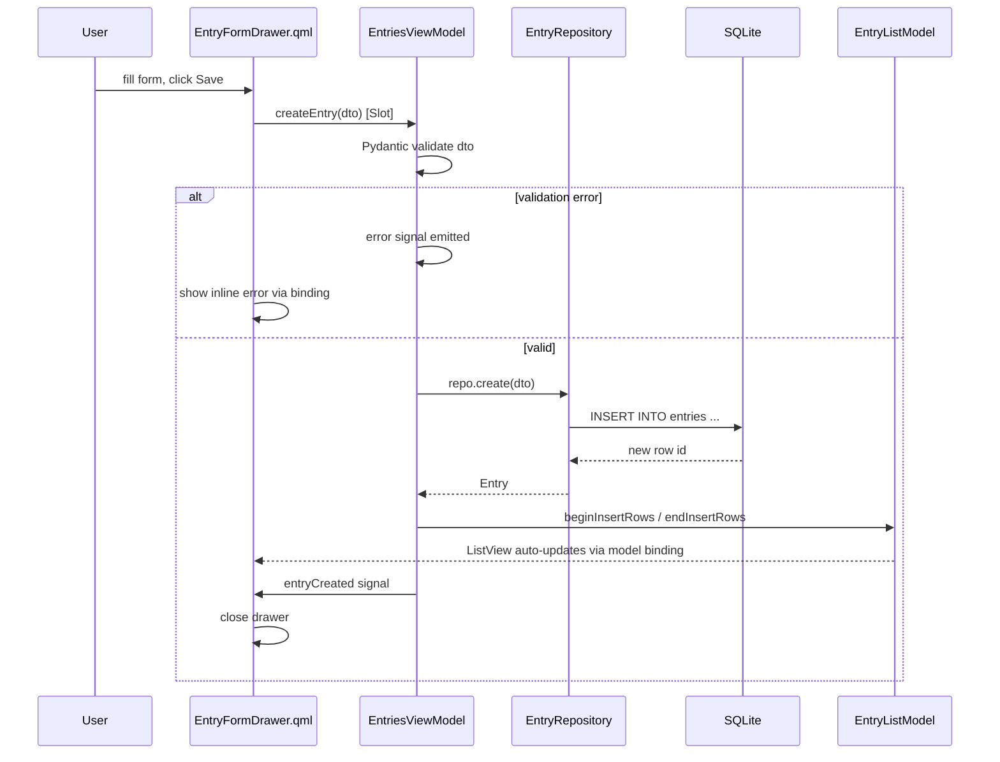
```mermaid
sequenceDiagram
    participant U as User
    participant QML as EntryFormDrawer.qml
    participant VM as EntriesViewModel
    participant R as EntryRepository
    participant DB as SQLite
    participant Model as EntryListModel

    U->>QML: fill form, click Save
    QML->>VM: createEntry(dto) [Slot]
    VM->>VM: Pydantic validate dto
    alt validation error
        VM->>VM: error signal emitted
        QML->>QML: show inline error via binding
    else valid
        VM->>R: repo.create(dto)
        R->>DB: INSERT INTO entries ...
        DB-->>R: new row id
        R-->>VM: Entry
        VM->>Model: beginInsertRows / endInsertRows
        Model-->>QML: ListView auto-updates via model binding
        VM->>QML: entryCreated signal
        QML->>QML: close drawer
    end
```

### 11.2 Simulation Run Flow

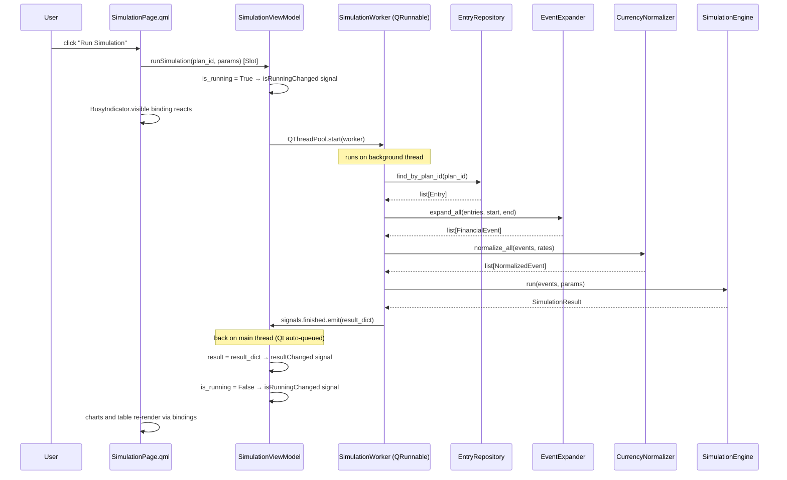
```mermaid
sequenceDiagram
    participant U as User
    participant QML as SimulationPage.qml
    participant VM as SimulationViewModel
    participant W as SimulationWorker (QRunnable)
    participant ER as EntryRepository
    participant EE as EventExpander
    participant CN as CurrencyNormalizer
    participant SE as SimulationEngine

    U->>QML: click "Run Simulation"
    QML->>VM: runSimulation(plan_id, params) [Slot]
    VM->>VM: is_running = True → isRunningChanged signal
    QML->>QML: BusyIndicator.visible binding reacts
    VM->>W: QThreadPool.start(worker)
    Note over W: runs on background thread
    W->>ER: find_by_plan_id(plan_id)
    ER-->>W: list[Entry]
    W->>EE: expand_all(entries, start, end)
    EE-->>W: list[FinancialEvent]
    W->>CN: normalize_all(events, rates)
    CN-->>W: list[NormalizedEvent]
    W->>SE: run(events, params)
    SE-->>W: SimulationResult
    W->>VM: signals.finished.emit(result_dict)
    Note over VM: back on main thread (Qt auto-queued)
    VM->>VM: result = result_dict → resultChanged signal
    VM->>VM: is_running = False → isRunningChanged signal
    QML->>QML: charts and table re-render via bindings
```

### 11.3 Plan Export and Import Flow (FR-17)

Plan portability is separate from simulation CSV/PDF export (FR-10) and spreadsheet entry import (FR-13). A `.ftplan` file is a versioned UTF-8 JSON document written atomically by `PlanExporter` and parsed by `PlanImportService`. Import always creates a **new plan** with fresh IDs; it never merges into an existing plan.

**`.ftplan` schema (format_version = 1):**

| Field | Type | Description |
|-------|------|-------------|
| `format_version` | `int` | Bundle schema version; only `1` is supported in v1. |
| `app` | `string` | Emitting application identifier (`cash-flow-planner-desktop`; legacy imports accept `financial-tracker-desktop`). |
| `exported_at` | `string` | ISO-8601 UTC timestamp of export. |
| `plan` | `object` | `name`, `base_currency` (user-selected at creation, default `USD`), `initial_balance`. |
| `entries` | `array` | Entry payloads without IDs: `entry_type`, `name`, `date_pattern`, `amount`, `currency`, optional `category`, `is_active`. |
| `exchange_rates` | `array` | Only `foreign → plan.base_currency` pairs referenced by entry currencies (omitted when all entries match the plan base). |
| `metadata` | `object` (optional) | Provenance block from `build_export_metadata`: `app`, `app_version`, `exported_at`, `methodology_version`, optional `display_currency` and `fx_rates`. Omitted in pre-Story-23 exports; importers ignore unknown keys. |

Exchange rates in the bundle are **app-wide** (not per plan). On import, rates missing on the device are inserted automatically. When a bundled rate conflicts with an existing global rate (same pair, different value), `PlanImportDialog` prompts the user per currency: **keep mine** or **use file's**. Conflicting rates are never silently overwritten.

If a plan with the same name already exists, import appends `" (imported)"` (repeated as needed) rather than failing. Invalid `format_version`, malformed JSON, or invalid `date_pattern` values raise `PlanImportError` with no partial DB writes.

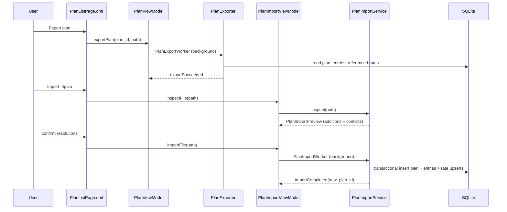
```mermaid
sequenceDiagram
    participant U as User
    participant QML as PlanListPage.qml
    participant PVM as PlanViewModel
    participant PE as PlanExporter
    participant PIVM as PlanImportViewModel
    participant PIS as PlanImportService
    participant DB as SQLite

    U->>QML: Export plan
    QML->>PVM: exportPlan(plan_id, path)
    PVM->>PE: PlanExportWorker (background)
    PE->>DB: read plan, entries, referenced rates
    PE-->>PVM: exportSucceeded
    U->>QML: Import .ftplan
    QML->>PIVM: inspectFile(path)
    PIVM->>PIS: inspect(path)
    PIS-->>PIVM: PlanImportPreview (additions + conflicts)
    U->>QML: confirm resolutions
    QML->>PIVM: importFile(path)
    PIVM->>PIS: PlanImportWorker (background)
    PIS->>DB: transactional insert plan + entries + rate upserts
    PIS-->>PIVM: importCompleted(new_plan_id)
```

### 11.4 Executive PDF Export Flow (FR-19, FR-22)

Simulation CSV/PDF export (FR-10) is extended by the **executive PDF report** (FR-19, refined by FR-22), generated by `PdfExporter` from an `ExportContext` DTO assembled in `ExportWorker`. The export runs on a background `QThreadPool` worker; failures surface via `SimulationViewModel.error`.

**Report sections** (omitted when not applicable):

| # | Section | Content |
|---|---------|---------|
| 1 | Cover / metadata | Forecast name, date range, export timestamp, app version, methodology version, display currency |
| 2 | Balance chart | Daily closing-balance projection rendered by `build_balance_chart_drawing` in `src/export/balance_chart_pdf.py` when `daily_balances` are present; positive area in primary tint, deficit area in red tint, zero reference line |
| 3 | Monthly cash bridge | Per month: opening, inflows, outflows, net, closing (`build_cash_bridge`); semantic colors from `src/export/pdf_colors.py` (green inflows, red outflows, signed net/closing); amber row background for deficit months |
| 4 | Scenario comparison | When what-if overrides are active: baseline vs scenario metrics and color-coded deltas |
| 5 | FX footnotes | Rate table for pairs used by the forecast (entry normalization and display conversion only); omitted when no FX is required |
| 6 | Methodology appendix | Full translated methodology text from `src/app/i18n/methodology_content.py` (version line plus section headings and bodies); replaces the former Settings pointer |

Provenance metadata appears once in the cover block. The redundant trailing metadata footer (`metadata_pdf_footer_html`) was removed in FR-22; CSV and `.ftplan` metadata paths are unchanged.

**Color rules** (`pdf_colors.py`): positive money values → green (`INCOME_GREEN`); zero or negative → red (`EXPENSE_RED`); scenario deltas use `delta_text_color` with `higher_is_better` per metric; deficit months use amber background (`DEFICIT_AMBER_BG`).

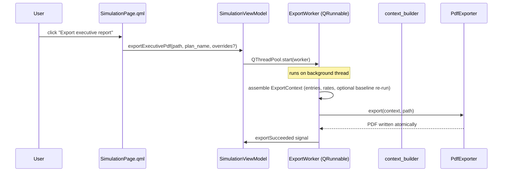
```mermaid
sequenceDiagram
    participant U as User
    participant QML as SimulationPage.qml
    participant VM as SimulationViewModel
    participant W as ExportWorker (QRunnable)
    participant CB as context_builder
    participant PE as PdfExporter

    U->>QML: click "Export executive report"
    QML->>VM: exportExecutivePdf(path, plan_name, overrides?)
    VM->>W: QThreadPool.start(worker)
    Note over W: runs on background thread
    W->>W: assemble ExportContext (entries, rates, optional baseline re-run)
    W->>PE: export(context, path)
    PE-->>W: PDF written atomically
    W->>VM: exportSucceeded signal
```

### 11.5 Forecast Template Flow (FR-20)

New forecasts can be created from bundled JSON templates instead of starting blank. Three archetypes ship in `src/templates/`: SaaS startup, consulting firm, and retail shop. Each template defines suggested plan metadata (`suggested_initial_balance`, `suggested_base_currency`) and a list of entry payloads using the same fields as `EntryCreateDTO`.

`TemplateService` (pure Python, no Qt) loads templates via `importlib.resources`, validates each entry's `date_pattern` through `parse_pattern()`, and returns a frozen `ForecastTemplate` DTO. `PlanViewModel.createFromTemplate(name, template_id)` creates the plan and bulk-inserts entries via `SqliteEntryRepository.create_many`. The created forecast is fully editable like any other forecast.

On `PlanListPage`, **New forecast** offers **Blank** or **From template**. The latter opens `TemplatePickerDialog.qml`, which lists templates by name and description. Invalid `template_id` or malformed template JSON surfaces via `PlanViewModel.error`.

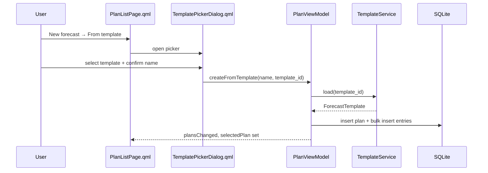
```mermaid
sequenceDiagram
    participant U as User
    participant QML as PlanListPage.qml
    participant TPD as TemplatePickerDialog.qml
    participant PVM as PlanViewModel
    participant TS as TemplateService
    participant DB as SQLite

    U->>QML: New forecast → From template
    QML->>TPD: open picker
    U->>TPD: select template + confirm name
    TPD->>PVM: createFromTemplate(name, template_id)
    PVM->>TS: load(template_id)
    TS-->>PVM: ForecastTemplate
    PVM->>DB: insert plan + bulk insert entries
    PVM-->>QML: plansChanged, selectedPlan set
```

### 11.6 Trust & Transparency (FR-21)

Three capabilities give professional users confidence in outputs without changing the simulation algorithm:

1. **Methodology page** — `MethodologyPage.qml` (reachable from Settings) explains cash shortfall detection (first day `closing_balance < 0`), date-pattern expansion, and multi-currency normalization. The executive PDF includes the same content as an inlined methodology appendix (FR-22).
2. **Audit trail** — `audit_log` records plan and entry create/update/delete with human-readable summaries. `AuditLogViewModel` loads entries newest-first for a read-only panel on the forecast detail layout. Simulation runs are not logged.
3. **Export metadata** — `src/export/metadata.py` builds a shared `ExportMetadata` DTO (app version, `exported_at`, methodology version, display currency, FX snapshot). Embedded in CSV comment rows and the optional `.ftplan` `metadata` block; cover metadata in the executive PDF.

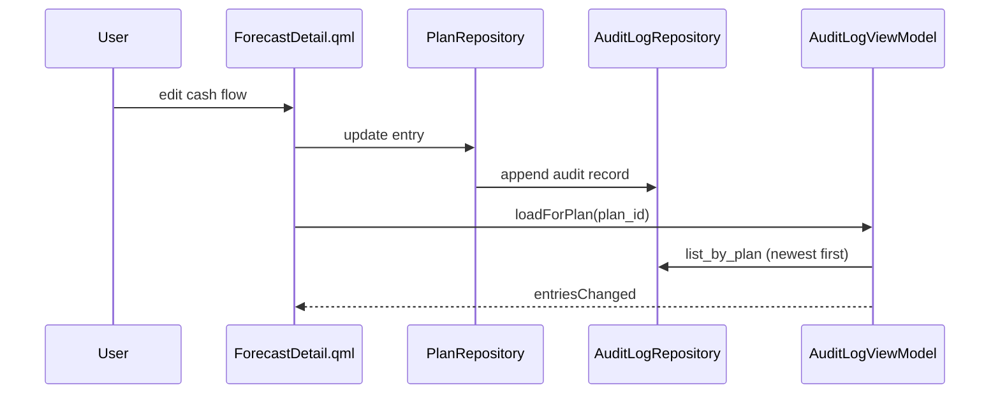
```mermaid
sequenceDiagram
    participant U as User
    participant QML as ForecastDetail.qml
    participant PR as PlanRepository
    participant ALR as AuditLogRepository
    participant ALVM as AuditLogViewModel

    U->>QML: edit cash flow
    QML->>PR: update entry
    PR->>ALR: append audit record
    QML->>ALVM: loadForPlan(plan_id)
    ALVM->>ALR: list_by_plan (newest first)
    ALVM-->>QML: entriesChanged
```

### 11.7 User Manual PDF (FR-23)

The **user manual** is a standalone narrative document for onboarding and reference. It complements — but does not replace — the in-app **Methodology** page (FR-21) and **executive PDF reports** (FR-19, FR-22):

| Document | Purpose | Audience |
|----------|---------|----------|
| User manual PDF | Step-by-step guide: forecasts, cash flows, projections, scenarios, import/export, settings | New users learning the app |
| Methodology page / PDF appendix | Calculation transparency: date-pattern expansion, normalization, cash shortfall detection | Users verifying how numbers are produced |
| Executive PDF report | Shareable output for a single forecast run (cash bridge, chart, scenario comparison) | Stakeholders reviewing a projection |

**Content module** — `src/app/i18n/manual_content.py` defines `ManualChapter`, `ManualSection`, and typed `ManualBlock` values (paragraph, bullet list, tip, note, important, pattern table). Accessors call `QCoreApplication.translate("UserManual", …)` so manual strings follow the same `.ts` / `.qm` workflow as the rest of the app (`MANUAL_VERSION` tracks manual revision independently of app version).

**Layout engine** — `ManualPdfExporter` in `src/export/manual_pdf_exporter.py` reuses ReportLab infrastructure from executive exports (`pdf_fonts.py`, `pdf_colors.py`) with dedicated styles in `manual_pdf_styles.py`: branded cover, printed TOC with dot leaders, PDF outline bookmarks, semantic callout tints, and page footers.

**Build and bundle** — `scripts/generate_manual.py` bootstraps a minimal `QApplication`, optionally installs `app_{locale}.qm`, and writes `CashFlowPlanner-UserManual_{locale}.pdf` to `resources/manual/` (Qt resource bundle) and `docs/manual/` (reference artifact). Use `--all` to generate every supported locale (`en`, `fr`, `ru`, `es`, `de`) before release builds. Build scripts invoke `generate_manual.py --all` before PyInstaller when manual content changes.

**Settings entry point** — `SettingsViewModel.openUserManual()` calls `src/app/user_manual.py`, which resolves `qrc:/manual/CashFlowPlanner-UserManual_{locale}.pdf`, copies the bytes to the app cache directory (required because some PDF viewers cannot open `qrc:` URLs directly), and launches the platform viewer via `QDesktopServices.openUrl`. Missing locale files fall back to English.

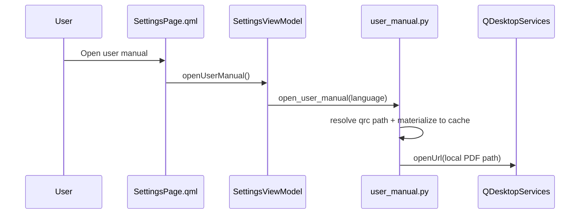
```mermaid
sequenceDiagram
    participant U as User
    participant QML as SettingsPage.qml
    participant SVM as SettingsViewModel
    participant UM as user_manual.py
    participant DS as QDesktopServices

    U->>QML: Open user manual
    QML->>SVM: openUserManual()
    SVM->>UM: open_user_manual(language)
    UM->>UM: resolve qrc path + materialize to cache
    UM->>DS: openUrl(local PDF path)
```

### 11.8 Cash-Flow Suggestions Flow (FR-24)

After a **baseline** projection completes, `SimulationViewModel` calls `SuggestionsViewModel.refreshForPlan`. Analysis runs on `SuggestionAnalysisWorker` (`QRunnable`); ranked suggestions are localized on the main thread and bound to `SuggestionListModel` for `SuggestionsPanel.qml`. What-if-only runs do not refresh suggestions.

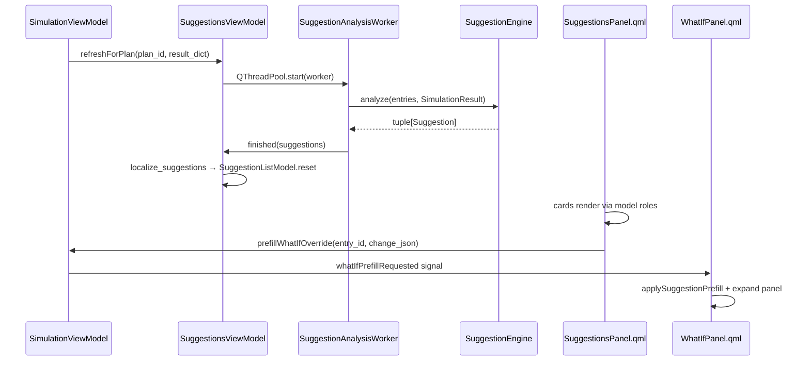
```mermaid
sequenceDiagram
    participant VM as SimulationViewModel
    participant SVM as SuggestionsViewModel
    participant W as SuggestionAnalysisWorker
    participant SE as SuggestionEngine
    participant QML as SuggestionsPanel.qml
    participant WIF as WhatIfPanel.qml

    VM->>SVM: refreshForPlan(plan_id, result_dict)
    SVM->>W: QThreadPool.start(worker)
    W->>SE: analyze(entries, SimulationResult)
    SE-->>W: tuple[Suggestion]
    W->>SVM: finished(suggestions)
    SVM->>SVM: localize_suggestions → SuggestionListModel.reset
    QML->>QML: cards render via model roles
    QML->>VM: prefillWhatIfOverride(entry_id, change_json)
    VM->>WIF: whatIfPrefillRequested signal
    WIF->>WIF: applySuggestionPrefill + expand panel
```

### 11.9 Expense Analytics Flow (FR-26)

The Spending tab loads with a default **this month** date filter. `ExpenseFilterBar` updates `RecordedExpensesViewModel` (filtered list + debounced search) and `ExpenseAnalyticsViewModel` (chart rollups) when the user changes presets or a custom range. Chart refresh runs synchronously on the main thread from repository queries; expense mutations trigger `ExpenseAnalyticsViewModel.refresh()` via Qt signals.

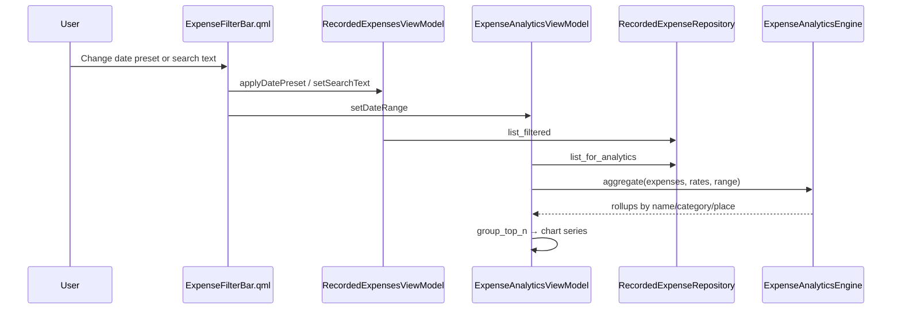
```mermaid
sequenceDiagram
    participant U as User
    participant FB as ExpenseFilterBar.qml
    participant REVM as RecordedExpensesViewModel
    participant EAVM as ExpenseAnalyticsViewModel
    participant R as RecordedExpenseRepository
    participant E as ExpenseAnalyticsEngine

    U->>FB: Change date preset or search text
    FB->>REVM: applyDatePreset / setSearchText
    FB->>EAVM: setDateRange
    REVM->>R: list_filtered
    EAVM->>R: list_for_analytics
    EAVM->>E: aggregate(expenses, rates, range)
    E-->>EAVM: rollups by name/category/place
    EAVM->>EAVM: group_top_n → chart series
```

---

## 12. UML Diagrams

### 12.1 Domain Class Diagram

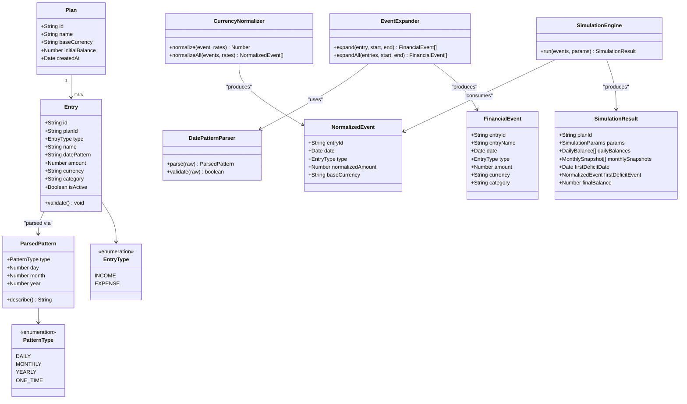
```mermaid
classDiagram
    class Plan {
        +String id
        +String name
        +String baseCurrency
        +Number initialBalance
        +Date createdAt
    }

    class Entry {
        +String id
        +String planId
        +EntryType type
        +String name
        +String datePattern
        +Number amount
        +String currency
        +String category
        +Boolean isActive
        +validate() void
    }

    class EntryType {
        <<enumeration>>
        INCOME
        EXPENSE
    }

    class ParsedPattern {
        +PatternType type
        +Number day
        +Number month
        +Number year
        +describe() String
    }

    class PatternType {
        <<enumeration>>
        DAILY
        MONTHLY
        YEARLY
        ONE_TIME
    }

    class FinancialEvent {
        +String entryId
        +String entryName
        +Date date
        +EntryType type
        +Number amount
        +String currency
        +String category
    }

    class NormalizedEvent {
        +String entryId
        +Date date
        +EntryType type
        +Number normalizedAmount
        +String baseCurrency
    }

    class SimulationResult {
        +String planId
        +SimulationParams params
        +DailyBalance[] dailyBalances
        +MonthlySnapshot[] monthlySnapshots
        +Date firstDeficitDate
        +NormalizedEvent firstDeficitEvent
        +Number finalBalance
    }

    class SimulationEngine {
        +run(events, params) SimulationResult
    }

    class EventExpander {
        +expand(entry, start, end) FinancialEvent[]
        +expandAll(entries, start, end) FinancialEvent[]
    }

    class CurrencyNormalizer {
        +normalize(event, rates) Number
        +normalizeAll(events, rates) NormalizedEvent[]
    }

    class DatePatternParser {
        +parse(raw) ParsedPattern
        +validate(raw) boolean
    }

    Entry --> EntryType
    Entry --> ParsedPattern : "parsed via"
    ParsedPattern --> PatternType
    EventExpander --> FinancialEvent : "produces"
    EventExpander --> DatePatternParser : "uses"
    CurrencyNormalizer --> NormalizedEvent : "produces"
    SimulationEngine --> SimulationResult : "produces"
    SimulationEngine --> NormalizedEvent : "consumes"
    Plan "1" --> "many" Entry
```

### 12.2 Entry State Machine

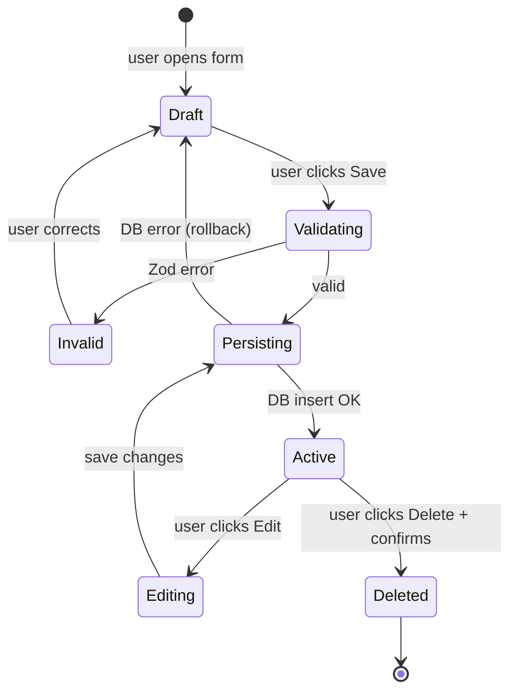
```mermaid
stateDiagram-v2
    [*] --> Draft: user opens form
    Draft --> Validating: user clicks Save
    Validating --> Invalid: Zod error
    Invalid --> Draft: user corrects
    Validating --> Persisting: valid
    Persisting --> Active: DB insert OK
    Persisting --> Draft: DB error (rollback)
    Active --> Editing: user clicks Edit
    Editing --> Persisting: save changes
    Active --> Deleted: user clicks Delete + confirms
    Deleted --> [*]
```

### 12.3 Application State Machine (Plan Workflow)

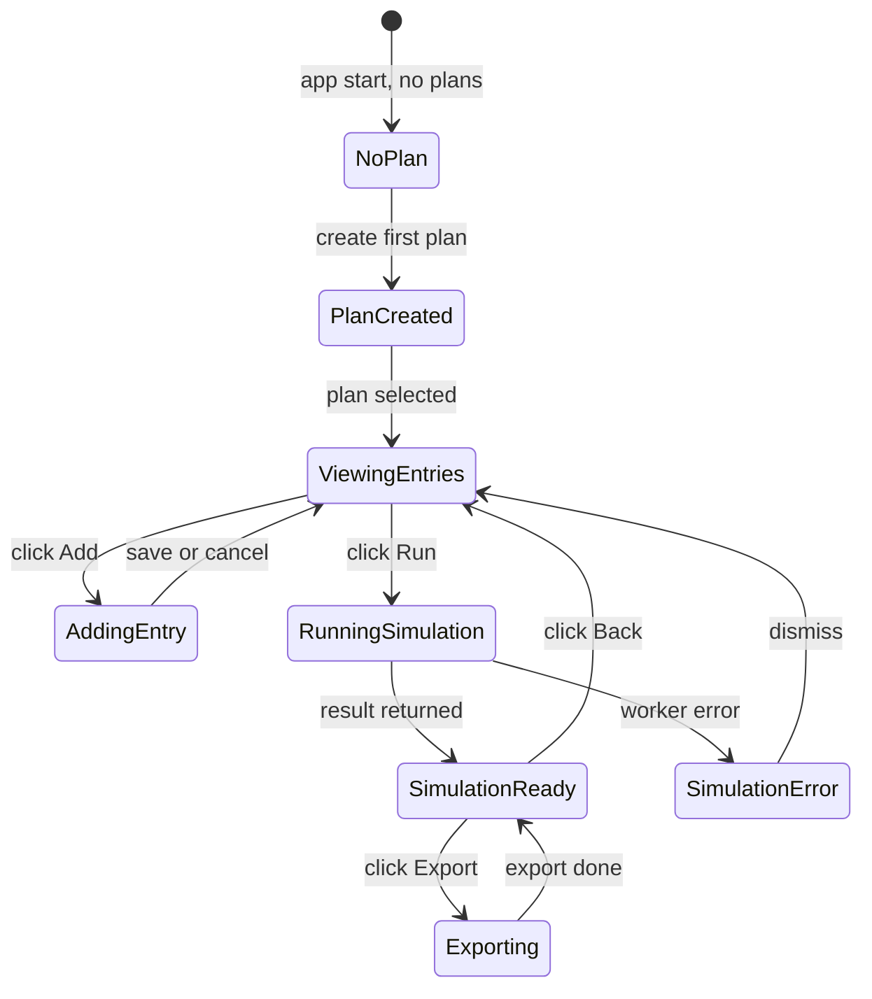
```mermaid
stateDiagram-v2
    [*] --> NoPlan: app start, no plans
    NoPlan --> PlanCreated: create first plan
    PlanCreated --> ViewingEntries: plan selected
    ViewingEntries --> AddingEntry: click Add
    AddingEntry --> ViewingEntries: save or cancel
    ViewingEntries --> RunningSimulation: click Run
    RunningSimulation --> SimulationReady: result returned
    RunningSimulation --> SimulationError: worker error
    SimulationError --> ViewingEntries: dismiss
    SimulationReady --> ViewingEntries: click Back
    SimulationReady --> Exporting: click Export
    Exporting --> SimulationReady: export done
```

---

## 13. Currency System

### 13.0 Plan Base Currency and Display Currency

Every plan stores a `base_currency` column (default `USD`). Users **choose the base currency** when creating a plan via the Create Plan dialog; simulation normalizes all entry amounts to that currency before running the balance engine.

**Display currency** is a presentation-layer choice on the Simulation page. The user picks a currency from the plan's base currency plus any foreign currency that has an `X → plan.base_currency` rate in the global table. Amounts in charts, tables, and exports are converted from the plan base using the inverse rate (`amount_base / rate_x_to_base`). Deficit detection and simulation semantics remain in the plan base currency; only the displayed/exported numbers change.

Display currency preference is persisted per plan in `QSettings` (`simulation/display_currency/{plan_id}`).

### 13.1 Exchange Rate Lookup

Exchange rates are stored in a **single global table** (no `plan_id`). The primary key is `(from_currency, to_currency)`; there is one rate per pair. **Manual and live-fetched rates use foreign currency → plan base currency pairs** (e.g. `EUR → USD` for a USD-base plan, `USD → EUR` for an EUR-base plan). When normalizing an event with currency C to plan base currency B:

1. Look up the row where `from_currency = C AND to_currency = B`.
2. If found, use `rate` (`amount_c * rate = amount_base`).
3. If not found and `C != B`, throw `CurrencyConversionError`.

For display conversion from plan base to foreign currency X, `convert_amount()` uses the inverse of the `X → base` rate when no direct `base → X` row exists.

> **Note:** Time-varying rates (multiple `effective_date` values per pair) were removed in Story 13. The single stored rate is assumed to be the current best value; users update it manually or via the live-fetch button.

### 13.2 Transitive Conversion

Direct rates only (no chained conversion in v1). If the user has EUR → USD and KZT → USD on a USD-base plan, amounts in EUR and KZT can both be normalized to USD. EUR → KZT would require an explicit rate or a round-trip through the plan base, which is not auto-computed.

### 13.3 Exchange Rate UI

`CurrencyRateEditor.qml` is embedded in the top-level **`SettingsPage`** (accessible from anywhere via the gear icon). It shows the global exchange rate table — not scoped to any plan. Users can add a new rate (foreign currency → the **selected plan's base currency**, or USD when no plan is selected), edit inline, delete individual rows, or **delete all** rates after confirmation. A **"Fetch live rates"** button is shown when the optional API integration is enabled (see 13.4); live fetch uses the selected plan's `base_currency` when available, otherwise USD.

### 13.4 Optional Live Rate Fetching (FR-15)

The `ExchangeRateFetcher` in `src/integrations/exchange_rate_fetcher.py` uses `httpx` to request rates from [ExchangeRate-API Open Access](https://www.exchangerate-api.com/docs/free) (default: `https://open.er-api.com/v6/latest/{base}` — free, no API key required; URL overridable via `QSettings` key `exchange_rate_api_url` for development only).

**Flow:**

1. User clicks "Fetch live rates" in `CurrencyRateEditor.qml`.
2. `SimulationViewModel.fetchLiveRates(base_currency)` is called via `@Slot`.
3. A `FetchRatesWorker(QRunnable)` runs `httpx.get(url, timeout=10)` off the main thread.
4. On success: the fetched rates are written to the DB as `ExchangeRate` rows with `source = "api"` and today's date as `effective_date`. The `CurrencyRateEditor` list refreshes via the model.
5. On failure (timeout, network error, non-200): an error signal is emitted; the UI shows a dismissible banner. All existing manual rates remain intact.

**Opt-in:** The feature is disabled by default. A toggle in the app-wide **Settings page** (`QSettings` key `exchange_rate_api_enabled`) enables it. When disabled, the "Fetch live rates" button is hidden and no network calls are ever made — preserving NFR-01 (fully offline by default).

**Attribution:** The Open Access endpoint requires attribution to [ExchangeRate-API](https://www.exchangerate-api.com). When live fetch is enabled, Settings shows a link to the provider.

**Live fetch limits (live API only):** To respect free-tier API quotas while allowing different plan base currencies, live fetches are limited to **once per minute** and **10 times per calendar day**. After a successful live fetch, `FetchRatesWorker` calls `record_successful_fetch()`, which persists the timestamp in `QSettings` (`exchange_rate_last_fetch_at`) and increments a daily counter (`exchange_rate_daily_fetch_count`, reset when `exchange_rate_daily_fetch_date` is not today). `can_fetch_live_rates()` returns `False` during the 1-minute cooldown or when the daily cap is reached; `SimulationViewModel.fetchLiveRates()` rejects the request with a user-visible error, and `SettingsViewModel.liveRatesFetchAvailable` / `secondsUntilLiveRatesFetch` / `liveRatesDailyLimitReached` reflect the remaining cooldown. The limits apply only to real HTTP fetches — not to the mock provider (see below).

**Developer mock provider:** When the application is started with `--dev`, a second toggle appears in `SettingsPage` — "Use mock exchange rates". When enabled, `fetch_rates()` returns hardcoded in-process rates (see `_MOCK_USD_RATES` in `exchange_rate_fetcher.py`) instead of contacting the live API. This allows developers and CI integration tests to exercise the full fetch-and-store pipeline without network access. **Mock fetches bypass the live fetch limits:** `can_fetch_live_rates()` always returns `True`, `seconds_until_next_fetch()` returns `0`, and `FetchRatesWorker` skips `record_successful_fetch()` so repeated mock fetches do not consume the daily quota or trigger the minute cooldown. The mock toggle is gated behind `is_dev_mode_enabled()` and is completely invisible in production builds. `SettingsViewModel` exposes two read-only/settable properties for this: `devModeEnabled` (constant, reflects the `--dev` flag at startup) and `useMockExchangeRates` (reads/writes `QSettings` key `exchange_rate_use_mock`, only writable when `devModeEnabled` is `True`).

```python
# src/integrations/exchange_rate_fetcher.py
import httpx

DEFAULT_API_URL = "https://open.er-api.com/v6/latest/{base}"

def fetch_rates(base: str, symbols: list[str]) -> dict[str, float]:
    """Returns {currency_code: rate_from_base} or raises FetchRatesError."""
    url = DEFAULT_API_URL.replace("{base}", base)
    resp = httpx.get(url, timeout=10)
    ...
    return data["rates"]   # e.g. {"EUR": 0.92, "KZT": 460.5}
```

---

## 14. Error Handling

### 14.1 Error Taxonomy

| Error Class | Where raised | User Impact |
|-------------|-------------|-------------|
| `DatePatternParseError` | `parse_pattern()` | Synchronous — inline error label below the `DatePatternInput` field. |
| `CurrencyConversionError` | `CurrencyNormalizer` | Simulation worker emits `error` signal; ViewModel exposes it via `error` Q_PROPERTY; QML shows a dismissible error banner. |
| `DatabaseError` | Repositories (SQLAlchemy) | ViewModel catches it, sets `error` property; QML `InfoBar` shows a retry button. |
| `SimulationOverflowError` | `SimulationEngine` | Raised if simulation range exceeds **10 years** (hard limit). Worker surfaces it via the error signal. |
| `ValidationError` (Pydantic) | ViewModels before repo calls | Fields highlighted red in the form; validation message shown inline. |

### 14.2 Strategy

- **Business logic layer:** Pure Python functions raise typed exceptions (`DatePatternParseError`, `CurrencyConversionError`, etc.). These exceptions never touch Qt — they are plain Python.
- **ViewModels:** All `@Slot` methods and worker `run()` methods catch exceptions, convert them to user-readable strings, and emit the ViewModel's `error` signal. The ViewModel sets its `error` Q_PROPERTY so QML bindings react automatically.
- **QML:** An `InfoBar` component at the top of each page binds `visible: viewModel.error !== ""`. Clicking dismiss calls `viewModel.clearError()`.
- **Unhandled exceptions:** Python's `sys.excepthook` is overridden to log the full traceback to a rotating file in `QStandardPaths.AppDataLocation`. A dialog is shown to the user asking if they want to restart.

---

## 15. Testing Strategy

### 15.1 Test Pyramid

```
           /\
          /E2E\        pytest-qt QTest automation — happy paths, deficit detection, export
         /------\
        /Integration\  pytest-qt — ViewModel ↔ Repository ↔ in-memory SQLite
       /------------\
      /  Unit Tests  \ pytest + hypothesis — date_pattern, simulation_engine, currency_normalizer
     /------------------\
```

### 15.2 Unit Test Coverage Targets

| Module | Target Coverage | Key Cases |
|--------|----------------|-----------|
| `date_pattern.py` | 100% | All 4 pattern types, invalid patterns, edge dates (Feb 29, day 31), hypothesis property tests |
| `event_expander` (in `date_pattern.py`) | 100% | Boundary dates, empty windows, month-end edge cases |
| `simulation_engine.py` | 95% | Zero events, all income, first deficit, exact zero balance |
| `currency_normalizer.py` | 95% | Direct rate, missing rate error, multiple effective dates |

### 15.3 Integration Test Scenarios

Integration tests use `pytest-qt` and an **in-memory SQLite** database (`:memory:`) to verify ViewModels without touching the file system.

1. `PlanViewModel.create_plan()` → `find_all()` returns the new plan.
2. `EntriesViewModel.create_entry()` — `EntryListModel.rowCount()` increases by 1.
3. `SimulationViewModel.run_simulation()` — mock `SimulationEngine`, verify `isRunning` transitions and `result` property is set.
4. `PlanExporter.export()` → `PlanImportService.import_bundle()` round-trip preserves plan metadata and entry fields with a new plan ID.
5. `PlanViewModel.exportPlan()` and `PlanImportViewModel.importFile()` emit `exportSucceeded` / `importCompleted` on background worker completion.

### 15.4 E2E Test Scenarios

E2E tests use `pytest-qt`'s `qtbot` to drive the live Qt application against a temp database.

1. **Happy path** — Create plan → add income and expense entries → run simulation → verify `monthlySnapshots` values match manual calculation from Section 1.
2. **Deficit detection** — Reduce income entry → re-run → verify `DeficitBanner.visible === true` and correct deficit date.
3. **Multi-currency** — Add EUR income, USD expenses, define EUR→USD rate → verify normalization in `SimulationResult`.
4. **Export** — Run simulation → export CSV → verify file written to temp dir, row count matches event count; export executive PDF → verify non-empty `%PDF` file created.
5. **Plan portability** — Create plan with entries → export `.ftplan` via `PlanViewModel` → import via `PlanImportViewModel` → verify new plan appears with matching entry count and fields.
6. **Migration** — Start app against v0 database file → verify Alembic upgrades schema to latest without data loss.

---

## 16. Build and Release Pipeline

### 16.1 Development Workflow

```
# Install dependencies
pip install -e ".[dev]"

# Run the app (QML hot-reloading via QML_IMPORT_TRACE + file watcher)
python main.py

# Run all tests
pytest

# Run tests with coverage
pytest --cov=src --cov-report=html
```

For QML live reloading in development, the app watches `qml/` for file changes using `watchdog` and calls `QQmlEngine.clearComponentCache()` + reloads the root component. Python code changes still require a manual restart.

The `--dev` flag enables two developer features simultaneously:

1. **QML hot-reload** — file watcher on `qml/`.
2. **Mock exchange-rate provider** — a "Use mock exchange rates" toggle appears in `SettingsPage`. When enabled, `fetch_rates()` returns hardcoded in-process rates without any network call, allowing the full fetch-and-store pipeline to be exercised locally with no live fetch limits (see §13.4).

```bash
python main.py --dev
```

### 16.2 CI Pipeline (GitHub Actions)

```mermaid
flowchart LR
    Push --> Lint
    Lint --> TypeCheck
    TypeCheck --> UnitTests
    UnitTests --> IntegrationTests
    IntegrationTests --> E2E
    E2E --> CreateTag["Create release tag\n(version bump on main)"]
    CreateTag --> BuildMacOS["Build macOS DMG"]
    CreateTag --> BuildWindows["Build Windows installer"]
    CreateTag --> BuildLinux["Build Linux AppImage"]
    TagPush["semver tag push\n(e.g. 1.0.0)\nor workflow_dispatch"] --> BuildMacOS
    TagPush --> BuildWindows
    TagPush --> BuildLinux
    E2E -.->|skipped on tag/dispatch| BuildMacOS
    E2E -.->|skipped on tag/dispatch| BuildWindows
    E2E -.->|skipped on tag/dispatch| BuildLinux
    BuildMacOS --> Release
    BuildWindows --> Release
    BuildLinux --> Release

    Release --> MacOS["macOS .dmg\n(optional sign + notarize)"]
    Release --> Windows["Windows .exe\n(Inno Setup)"]
    Release --> Linux["Linux .AppImage"]
```

When `pyproject.toml` version increases on a push to `main`, the **Create release tag** job
tags that commit and the build jobs run in the **same workflow run** (tags pushed by
`GITHUB_TOKEN` do not start a separate workflow).

| CI Step | Tool |
|---------|------|
| Lint | `ruff` (fast Python linter) |
| Type check | `mypy --strict` |
| Compile i18n | `poe i18n-bundle` in unit tests — produces embedded `.qm` files for all 5 locales |
| Unit + integration tests | `pytest` on Python 3.12, 3.13 |
| E2E | `pytest-qt` with `QT_QPA_PLATFORM=offscreen` (headless) |
| Create release tag | After E2E on `main` push — if `pyproject.toml` version increased, create semver tag (e.g. `1.3.1`) on the commit |
| Build macOS | On semver tag push (e.g. `1.0.0`), auto-tag after version bump on `main`, or manual `workflow_dispatch` — `./scripts/build.sh --dmg` on `macos-latest`; uploads `cash-flow-planner-{version}-mac.dmg` |
| Build Windows | On semver tag push (e.g. `1.0.0`), auto-tag after version bump on `main`, or manual `workflow_dispatch` — `.\scripts\build.ps1` on `windows-latest`; uploads `cash-flow-planner-{version}-win-setup.exe` |
| Build Linux | On semver tag push (e.g. `1.0.0`), auto-tag after version bump on `main`, or manual `workflow_dispatch` — `./scripts/build.sh --appimage` on `ubuntu-latest`; uploads `cash-flow-planner-{version}-linux.AppImage` |
| Release | On semver tag push (e.g. `1.0.0`), auto-tag after version bump on `main`, or manual `workflow_dispatch` — publishes macOS, Windows, and Linux installers to GitHub Releases |

### 16.3 Release Artifacts

| Artifact | Description |
|----------|-------------|
| `cash-flow-planner-{version}-mac.dmg` | macOS universal binary (x86_64 + arm64 via `lipo`) wrapped in a DMG |
| `cash-flow-planner-{version}-win-setup.exe` | Windows Inno Setup installer wrapping the PyInstaller output |
| `cash-flow-planner-{version}-linux.AppImage` | Self-contained AppImage (no Python or Qt required on target machine) |

### 16.4 Update Strategy

PyInstaller bundles do not support binary delta patching. Updates are delivered as full installer downloads. The app checks a GitHub Releases JSON endpoint at startup; if a newer version tag is found, a banner prompts the user to download and run the new installer. The download URL opens in the system browser.

---

## 17. Non-Functional Requirements

### 17.1 Performance

| Scenario | Target |
|----------|--------|
| Simulation: 10 years, 50 daily entries | < 2 seconds |
| App cold start | < 3 seconds |
| Entry list render (1000 entries) | < 100ms (virtualized list) |
| DB write (single entry) | < 5ms |

### 17.2 Security

- **No network surface** — the application makes no outbound connections in v1. There is no attack surface from remote code.
- **No `eval` / dynamic code execution** — QML does not evaluate user-supplied strings as code. All QML files are bundled at build time.
- **Parameterized SQL** — all queries go through SQLAlchemy Core with bound parameters; no string concatenation for SQL.
- **Input validation** — all data entering the domain layer passes through Pydantic models before any DB write. Invalid data is rejected with a typed error, not silently truncated.
- **Database file location** — stored in `QStandardPaths.AppDataLocation` (e.g., `~/Library/Application Support/CashFlowPlanner/CashFlowPlannerDesktop/` on macOS), not alongside the binary, and not in a world-readable temp directory. First launch after upgrade from the legacy **Financial Tracker** identity copies data from `FinancialTracker/` via `src/app/identity_migration.py`. Frozen builds include an explicit guard in `resolve_database_path()` so the database never resolves inside the install directory or PyInstaller `_MEIPASS` tree.
- **Installer integrity** — build scripts pre-clean PyInstaller output, run `scripts/verify_bundle_clean.py` after bundling, and exclude `*.db` from the Windows Inno Setup `[Files]` section so dev databases cannot leak into distributable artifacts.

### 17.3 Accessibility

- All interactive elements have visible focus rings.
- Form inputs have associated `<label>` elements.
- Charts include a data table fallback for screen reader users.
- Color is never the sole differentiator — deficit rows use both red color and a warning icon.

### 17.4 Localization

The app ships with five languages: **English** (default), **French**, **Russian**, **Spanish**, and **German**. The implementation uses Qt's standard i18n pipeline:

- All user-visible QML strings are wrapped in `qsTr()`.
- `pyside6-lupdate` extracts strings into `.ts` XML source files in `i18n/`.
- `pyside6-lrelease` compiles `.ts` files into binary `.qm` files bundled in the Qt resource system under `:/i18n/`.
- `main.py` reads the `language` key from `QSettings` (default `"en"`) and installs the matching `QTranslator` before creating the `QQmlApplicationEngine`.
- Live language switching is supported: `SettingsViewModel.setLanguage()` swaps the active translator and calls `engine.retranslate()`, which re-evaluates all `qsTr()` bindings in the live QML tree — no app restart required.

Number and date formatting uses Qt's `QLocale` for locale-aware display (decimal separators, date order, etc.).

---

## Appendix A — Glossary

| Term | Definition |
|------|-----------|
| **Plan** | A named financial scenario containing entries, exchange rates, and simulation runs. |
| **Entry** | A named income or expense item with a date pattern, amount, and currency. |
| **Date Pattern** | A string like `10..` that encodes recurrence (daily, monthly, yearly, one-time). |
| **FinancialEvent** | A concrete occurrence of an entry on a specific calendar date. |
| **Simulation** | The process of expanding entries into events, normalizing currencies, and computing running balance over a time window. |
| **Deficit** | A state where the running balance drops below zero. |
| **Base Currency** | The single currency to which all amounts are normalized for arithmetic and display within a plan. |
| **Exchange Rate** | A user-defined conversion factor between two currencies, optionally time-scoped. |

## Appendix B — Resolved Design Decisions

| # | Question | Decision |
|---|----------|----------|
| 1 | Should daily entries be summed into a single "daily total" event per day for performance, or kept as individual events for drill-down? | **Daily total.** Events for a given day are collapsed into `DailyBalance.day_income` / `day_expense` at the display level. Individual `FinancialEvent` objects are retained in `DailyBalance.events` for future drill-down but are not exposed in v1 UI. See Section 8.3. |
| 2 | Should the app support importing entries from CSV/Excel files? If yes, how is the date pattern encoded in the import format? | **Yes.** CSV (stdlib `csv`) and XLSX (`openpyxl`) are both supported. The `date_pattern` column uses the same string syntax as the app: `...` (daily), `10..` (monthly), `10.02.` (yearly), `10.02.2026` (one-time). See FR-13, Section 4.1, and `src/integrations/import_service.py`. |
| 3 | Is a "what-if" mode needed — running a simulation with a temporary override on one entry without saving it? | **Yes.** Users can override entry fields (amount, pattern, active state) in the `WhatIfPanel` and run `simulationViewModel.runWhatIf()`. Overrides are applied in-memory inside `SimulationWorker` and never persisted. The plan is unchanged after the run. See FR-14 and Section 9.1. |
| 4 | What is the maximum supported simulation range? | **10 years hard limit.** The end-date picker in `SimulationControls.qml` clamps to today + 10 years. The engine raises `SimulationOverflowError` if this is exceeded programmatically. See Section 14.1 and NFR-03. |
| 5 | Should exchange rates be fetched from a public API via `httpx` as an optional feature? | **Yes.** An opt-in "Fetch live rates" button in `CurrencyRateEditor.qml` calls `ExchangeRateFetcher` (ExchangeRate-API Open Access at `open.er-api.com` by default — no API key; URL overridable via `QSettings` for development). The feature is disabled by default to keep the app fully offline (NFR-01). Attribution to ExchangeRate-API is shown in Settings when enabled. See FR-15 and Section 13.4. |
| 6 | Should the Settings page be scoped to a plan (a tab in `PlanDetailLayout`) or be app-wide? | **App-wide.** All preferences (dark mode, language, exchange rates) apply to the whole application, not a single plan. The Settings page is now a top-level `StackView` entry reachable from a persistent gear `ToolButton` in the toolbar. `PlanDetailLayout` retains only the Entries and Simulation tabs. See Section 10.1 and Task 13_1. |
| 7 | Should exchange rates be stored per-plan or globally? | **Globally.** Having one rate per currency pair across all plans is simpler and more intuitive — users do not expect EUR→USD to differ between their "Conservative" and "Aggressive" plans. The `plan_id` column was dropped in migration `0005_global_exchange_rates.py`; the primary key is now `(from_currency, to_currency)`. Time-varying rates (multiple `effective_date` rows) were also removed; a single current rate per pair is sufficient. See Section 5.1, 7.1, 13.1, and Task 13_2. |
| 8 | Should the app support multiple UI languages? If yes, should language switching require a restart? | **Yes, five languages; no restart required.** English, French, Russian, Spanish, and German are shipped. Switching is live: `SettingsViewModel.setLanguage()` swaps the `QTranslator` and calls `QQmlEngine.retranslate()`. The selected language is persisted in `QSettings`. See FR-16, Section 17.4, and Tasks 13_3–13_4. |
| 9 | How should the exchange-rate fetcher be tested without network access or a real API key? | **In-process mock provider gated behind `--dev`.** `configure_dev_mode(enabled=True)` (called in `main.py` when `--dev` is passed) unlocks a `useMockExchangeRates` toggle in `SettingsPage`. When active, `fetch_rates()` returns hardcoded values from `_MOCK_USD_RATES` with no HTTP call and no live fetch limits (`can_fetch_live_rates()` always permits fetch; `record_successful_fetch()` is skipped). The mock is invisible and inert in production. Integration tests call `configure_dev_mode(enabled=True)` + `set_use_mock_rates(True)` in fixtures and restore the defaults in teardown. See Section 13.4 and `src/integrations/exchange_rate_fetcher.py`. |
| 10 | Should users be able to move a complete plan between devices? | **Yes, via `.ftplan` export/import (FR-17).** Export bundles plan metadata, all entries, and referenced `foreign → plan.base_currency` rates. Import creates a new plan; rate conflicts require explicit user choice. See Section 11.3, `src/export/plan_exporter.py`, and `src/integrations/plan_import_service.py`. |
